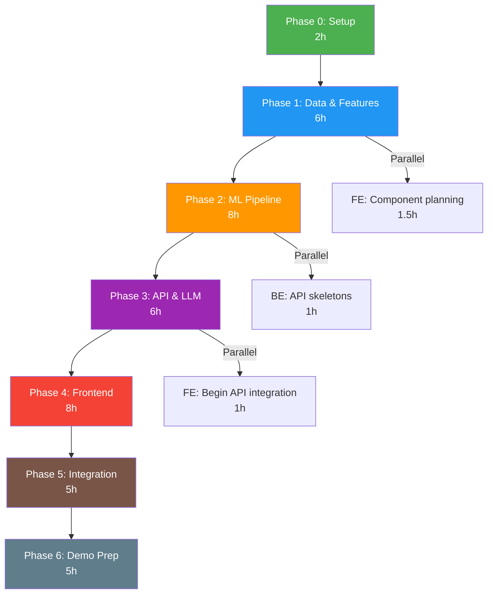
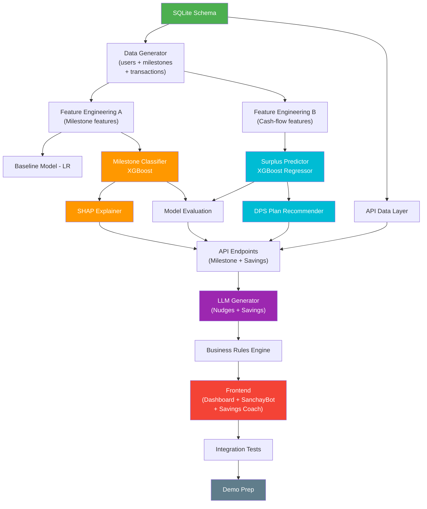

# PLAN: MilestoneAI + SanchayBot — Build Plan & Demo Strategy

**Version:** 2.0 (Hybrid)  
**Date:** 2026-10-01  
**Team:** 3 students (50 hours total build time)  
**Product:** MilestoneAI + SanchayBot — Hybrid Activation & Savings Intelligence for upay

---

## Team Roles

| Role | ID | Responsibilities |
|------|----|-----------------|
| **ML Engineer (ML)** | Team Member 1 | Synthetic data generation (users + transactions), feature engineering (milestone + cash-flow), model training (classifier + surplus regressor), SHAP, fairness checks, model evaluation |
| **Backend Engineer (BE)** | Team Member 2 | FastAPI API, database setup, business rules engine (nudge + DPS), LLM integration (nudges + savings explanations), prompt engineering, monitoring/logging |
| **Frontend Engineer (FE)** | Team Member 3 | Next.js dashboard, UI components, data visualization (charts, SHAP waterfall, spending donut, savings growth), Savings Coach page, i18n (Bangla/English), demo preparation |

---

## Phase Overview

| Phase | Duration | Hours (per person) | Goal |
|-------|----------|-------------------|------|
| Phase 0: Setup | 2h | 2h each = 6h total | Repo, environment, tooling ready |
| Phase 1: Data & Features | 7h | ML: 7h, BE: 4h, FE: 2h | Synthetic data generated (users + **transactions**), features computed (milestone + **cash-flow**), DB populated |
| Phase 2: ML Pipeline | 9h | ML: 9h, BE: 2h, FE: 0h | Milestone classifier + **surplus regressor** trained, SHAP computed, fairness checked |
| Phase 3: API & LLM | 7h | ML: 1h, BE: 7h, FE: 1h | All API endpoints working (milestone + **savings**), LLM nudge + **savings explanation** generation |
| Phase 4: Frontend | 9h | ML: 0h, BE: 2h, FE: 9h | Dashboard, User Detail (with **SanchayBot panel**), **Savings Coach page**, Model Performance pages |
| Phase 5: Integration & Testing | 5h | ML: 2h, BE: 3h, FE: 3h | End-to-end flow working (both modules), tests passing, bugs fixed |
| Phase 6: Polish & Demo | 4h | ML: 1h, BE: 1h, FE: 2h | Demo rehearsed (milestone + savings flow), pitch prepared, UI polished |
| **Buffer** | 2h | Distributed | Overflow, unexpected issues |

**Total:** ~45h planned + 5h buffer = 50h

---

## Phase 0: Setup (2 hours)

### Goal
Repository initialized, all dependencies installed, team can run the dev stack locally.

### Deliverables
- [x] Git repository initialized with `.gitignore`, `README.md`
- [x] Python virtual environment with all ML/API dependencies
- [x] Next.js project scaffolded with TypeScript
- [x] SQLite database created with schema
- [x] `.env.template` with all required environment variables
- [x] Docker Compose file (for single-command startup)
- [x] CI-ready project structure

### Tasks

| Task | Owner | Time | Dependencies |
|------|-------|------|-------------|
| Create repo structure (see IMPLEMENTATION.md) | BE | 20min | None |
| Initialize Python venv, install requirements.txt | ML | 15min | Repo structure |
| Initialize Next.js project with TypeScript | FE | 20min | Repo structure |
| Create SQLite schema (users, milestone_events, early_activity, **transactions, cashflow_summary**, predictions, nudges, savings_plans, traces) | BE | 40min | Repo structure |
| Create `.env.template` with GEMINI_API_KEY, API_KEY, DB_PATH | BE | 10min | None |
| Create `docker-compose.yml` for backend + frontend | BE | 15min | Schema |
| Verify all team members can `npm run dev` and `uvicorn` locally | All | 10min | All above |

### Definition of Done
- `python -c "import xgboost, shap, fastapi"` succeeds
- `npm run dev` starts Next.js on `localhost:3000`
- `uvicorn main:app` starts FastAPI on `localhost:8000`
- SQLite database created with all tables (empty)

### Go/No-Go Checkpoint
**Question:** Can all 3 team members run the full stack locally?  
**Go:** Yes → Proceed to Phase 1  
**No-Go:** Debug environment issues (allocate from buffer)

---

## Phase 1: Data & Features (7 hours)

### Goal
50,000 synthetic users generated with realistic patterns including **transaction data and cash-flow summaries**, features computed, data stored in SQLite.

### Deliverables
- [x] Synthetic data generator script
- [x] 50,000 users with registration metadata
- [x] Milestone events for all users (6 milestones each)
- [x] Early activity data for all users
- [x] **Transaction data (15-60 transactions per user)**
- [x] **Cash-flow summary table (income, expenses, surplus per user)**
- [x] Feature engineering pipeline (milestone features + **cash-flow features**)
- [x] Train/validation/test split (70/15/15)
- [x] Data validation checks passing
- [x] Synthetic data documentation

### Tasks

| Task | Owner | Time | Dependencies |
|------|-------|------|-------------|
| Write `generate_users()` — registration metadata | ML | 1.5h | Schema |
| Write `generate_early_activity()` — behavioral signals | ML | 1h | Users generated |
| Write `generate_milestones()` — with 8 milestone injected patterns (P1-P8) | ML | 2h | Users + Activity |
| **Write `generate_transactions()` — income/expense transactions with categories** | **ML** | **1.5h** | **Users generated** |
| **Write `generate_cashflow_summary()` — derive monthly income, expenses, surplus, cash-out ratio** | **ML** | **45min** | **Transactions generated** |
| Write data validation checks (row counts, null checks, distribution checks) | ML | 30min | All data |
| Write feature engineering pipeline (`build_milestone_features()` + **`build_cashflow_features()`**) | ML | 1.5h | All data |
| Store generated data in SQLite | BE | 1h | Generator scripts |
| Create data exploration notebook (distributions, correlations) | ML | Optional (stretch) | All data |
| Set up API data access layer (SQLAlchemy models or raw SQL) | BE | 2h | Schema + Data |
| Review synthetic data documentation | FE | 30min | Documentation |
| Begin UI component planning (wireframes to components — **including Savings Coach page**) | FE | 1.5h | PRD wireframes |

### Definition of Done
- `users` table has 50,000 rows
- `milestone_events` table has 300,000 rows (6 per user)
- `early_activity` table has 50,000 rows
- **`transactions` table has ~1.5M rows (avg 30 per user)**
- **`cashflow_summary` table has 50,000 rows**
- Milestone feature matrix has shape (50000, 22+)
- **Cash-flow feature matrix has shape (50000, 11+)**
- Train/val/test split files saved
- All 8 milestone patterns (P1-P8) + **6 cash-flow patterns (P9-P14)** produce statistically detectable effects

### Go/No-Go Checkpoint
**Question:** Do the synthetic data distributions look realistic and are injected patterns detectable?  
**Go:** Yes → Proceed to Phase 2  
**No-Go:** Adjust pattern injection strengths or fix generation bugs (allocate 1h from buffer)

---

## Phase 2: ML Pipeline (9 hours)

### Goal
Baseline and main models trained, evaluated, SHAP explanations computed, fairness checked. **Surplus prediction model trained for SanchayBot.**

### Deliverables
- [x] Logistic Regression baseline model (milestone)
- [x] XGBoost multi-output classifier (milestone)
- [x] **XGBoost regressor for monthly surplus prediction (SanchayBot)**
- [x] SHAP TreeExplainer configured (both models)
- [x] Model evaluation report (AUC-ROC for classifier, MAE/R² for regressor)
- [x] Fairness report (urban/rural, male/female)
- [x] **DPS Plan Recommender business rules engine**
- [x] Saved model artifacts (`.joblib` files)
- [x] Pre-computed SHAP values for test set

### Tasks

#### Module A: Milestone Classifier

| Task | Owner | Time | Dependencies |
|------|-------|------|-------------|
| Train Logistic Regression baseline for M2, M3, M4, M5 | ML | 1.5h | Feature matrix |
| Evaluate baseline (AUC-ROC, precision, recall per milestone) | ML | 30min | Baseline model |
| Train XGBoost with hyperparameter tuning (RandomizedSearchCV) | ML | 2h | Feature matrix |
| Evaluate XGBoost (AUC-ROC, precision, recall, F1, confusion matrix) | ML | 30min | XGBoost model |
| Generate calibration plots (predicted vs actual probability) | ML | 30min | XGBoost model |
| Compute SHAP values (TreeExplainer) for validation + test sets | ML | 1h | XGBoost model |
| Generate feature importance plots (mean absolute SHAP) | ML | 30min | SHAP values |
| Run fairness check: metrics by urban/rural, male/female | ML | 1h | XGBoost + test data |

#### Module B: Surplus Predictor (SanchayBot)

| Task | Owner | Time | Dependencies |
|------|-------|------|-------------|
| **Train XGBoost regressor on cash-flow features → predict surplus** | **ML** | **1h** | **Cash-flow feature matrix** |
| **Evaluate surplus model (MAE, R², scatter plot)** | **ML** | **30min** | **Surplus model** |
| **Implement DPS Plan Recommender business rules (surplus → amount/tenure/maturity)** | **ML** | **30min** | **Surplus prediction** |

#### Shared Tasks

| Task | Owner | Time | Dependencies |
|------|-------|------|-------------|
| Save all model artifacts to `models/` directory | ML | 15min | Trained models |
| Write model evaluation summary document | ML | 15min | All evaluations |
| Set up model loading utilities for API (both models) | BE | 1h | Saved models |
| Begin API endpoint skeletons | BE | 1h | Model utilities |

### Target Metrics

#### Module A: Milestone Classifier

| Metric | Baseline (LR) | Target (XGBoost) |
|--------|---------------|-----------------|
| AUC-ROC (overall) | ~0.68 | >= 0.78 |
| AUC-ROC (M4) | ~0.72 | >= 0.80 |
| Precision @50% | ~0.60 | >= 0.70 |
| Recall @50% | ~0.55 | >= 0.65 |
| Fairness (EO ratio) | Unchecked | >= 0.80 |

#### Module B: Surplus Predictor

| Metric | Target |
|--------|--------|
| MAE (surplus prediction) | <= ৳500 |
| R² | >= 0.75 |
| DPS recommendation within ±৳200 of ground truth | >= 85% |

### Definition of Done
- XGBoost classifier AUC-ROC >= 0.75 on clean test set (if <0.75, investigate and document)
- XGBoost beats Logistic Regression baseline on all milestones
- **Surplus regressor R² >= 0.70 on test set**
- **DPS recommender produces valid plans (amount >= ৳200, tenure in [6,12,18,24,36])**
- SHAP values computed for at least the test set (7,500 users)
- Fairness report generated with no critical disparities (>1.3 ratio)
- All model files saved and loadable by API

### Go/No-Go Checkpoint
**Question:** Does XGBoost meaningfully beat the baseline, and are SHAP explanations interpretable?  
**Go:** AUC >= 0.75, SHAP shows meaningful features → Proceed to Phase 3  
**No-Go if AUC < 0.70:** Investigate feature engineering, pattern injection strength. Consider adding interaction features. (Allocate 2h from buffer)

---

## Phase 3: API & LLM (7 hours)

### Goal
All API endpoints functional (milestone + **savings**), LLM nudge + **savings explanation** generation working with guardrails, business rules engine implemented.

### Deliverables
- [x] FastAPI app with all **9 endpoints** (7 milestone + **2 savings**)
- [x] Business rules engine (nudge frequency, eligibility, cooldown, **DPS constraints**)
- [x] LLM nudge generator with Gemini API
- [x] **LLM savings coach explainer with Gemini API**
- [x] Prompt templates for Bangla nudge generation **+ savings explanation**
- [x] Prompt injection defenses
- [x] Output validation guardrails
- [x] Fallback template-based nudges **and savings explanations** (for API downtime)
- [x] Audit trail logging to SQLite

### Tasks

#### Module A: Milestone API

| Task | Owner | Time | Dependencies |
|------|-------|------|-------------|
| Implement `GET /funnel` endpoint | BE | 30min | Data layer |
| Implement `GET /at-risk-users` endpoint with model scoring | BE | 1h | Model loading |
| Implement `GET /users/{id}/prediction` with SHAP | BE | 1h | Model + SHAP |
| Implement business rules engine (max 2 nudges/week, 48h cooldown, milestone filter) | BE | 45min | None |
| Implement `POST /nudges/{id}/approve` with audit logging | BE | 30min | DB schema |
| Implement `GET /model/metrics` endpoint | BE | 30min | Model evaluation |
| Implement `GET /model/fairness` endpoint | ML | 30min | Fairness data |
| Implement `GET /traces` endpoint | BE | 20min | Trace logging |

#### Module B: SanchayBot API

| Task | Owner | Time | Dependencies |
|------|-------|------|-------------|
| **Implement `GET /users/{id}/savings-plan` — cash-flow + DPS recommendation** | **BE** | **1h** | **Surplus model + Recommender** |
| **Implement `POST /savings-plan/goal` — goal-based feasibility (stretch)** | **BE** | **30min** | **Savings plan endpoint** |
| **Implement M5 nudge enrichment — when drop-off=M5, inject savings plan into nudge context** | **BE** | **30min** | **Both modules** |

#### Shared: LLM Integration

| Task | Owner | Time | Dependencies |
|------|-------|------|-------------|
| Write Gemini prompt template for Bangla nudge generation (M2-M4) | BE | 45min | Prediction output |
| **Write Gemini prompt template for M5 nudge (includes savings plan context)** | **BE** | **30min** | **Savings plan data** |
| **Write Gemini prompt template for savings coach explanation** | **BE** | **30min** | **Cash-flow data** |
| Implement prompt injection defense (input sanitization regex) | BE | 30min | Prompt templates |
| Implement output validation (no URLs, correct bonus amounts, length, **no guaranteed returns**) | BE | 30min | LLM output |
| Write 10 fallback template nudges (2 per milestone, in Bangla) **+ 3 savings explanation templates** | BE | 40min | None |
| Test all endpoints with `httpie` or Swagger UI | BE | 30min | All endpoints |
| Begin setting up API calls from frontend | FE | 1h | Working endpoints |

### Business Rules Engine Specification

```
NUDGE RULES:
1. max_nudges_per_week_per_user = 2
2. min_hours_between_nudges = 48
3. do_not_nudge_completed_milestone = True
4. do_not_nudge_opted_out_users = True  (simulated)
5. prioritize_highest_risk_milestone = True
6. nudge_only_within_campaign_window = True  (30 days from registration)

DPS RECOMMENDATION RULES (SanchayBot):
7. min_dps_amount = 200  (৳200/month minimum)
8. max_dps_amount = 5000  (৳5,000/month cap)
9. dps_percentage_of_surplus = 0.20 to 0.30  (recommend 20-30% of surplus)
10. min_surplus_for_dps = 500  (don't recommend DPS if surplus < ৳500)
11. tenure_options = [6, 12, 18, 24, 36]  (months)
12. annual_return_estimate = 0.05  (5% for maturity projection)
13. free_cashout = "UCB ATM"  (from upay document)
```

### LLM Prompt Templates

#### Template A: Milestone Nudge (M2-M4)

```
System: You are a helpful upay campaign assistant. Generate a short, encouraging 
Bangla nudge message (50-120 words) for a upay user who is at risk of not 
completing a milestone. The nudge must:
- Reference the specific milestone action
- Mention the exact bonus amount in BDT
- Be encouraging, not pressuring
- Not promise anything beyond the defined campaign bonuses
- Not include URLs, phone numbers, or financial advice
- Use simple Bangla appropriate for the user's context

User Context:
<user_context>
Milestone: {milestone}
Bonus: {bonus_bdt} taka
Risk factors: {top_3_factors}
User area: {area_type}
Device: {device_type}
Language: {language_preference}
</user_context>

Generate the nudge in Bangla only.
```

#### Template B: M5 DPS Nudge (Enriched with Savings Plan)

```
System: You are a helpful upay financial wellness assistant. Generate a short, 
encouraging Bangla nudge message (80-150 words) for a upay user who has not yet 
opened a DPS account. The nudge must:
- Explain what DPS is in simple terms
- Mention the ৳50 milestone bonus for opening DPS
- Include the PERSONALIZED savings recommendation below
- Mention that maturity funds can be cashed out free via UCB ATM
- Use "projected" not "guaranteed" for maturity estimates
- Be encouraging, not pressuring
- Use simple Bangla appropriate for the user's context

User Context:
<user_context>
User area: {area_type}
Device: {device_type}
Monthly surplus: {surplus_bdt} taka
Recommended DPS amount: {dps_amount_bdt} taka/month
Recommended tenure: {tenure_months} months
Projected maturity: {maturity_bdt} taka
Top expense category: {top_expense_category}
Cash-out ratio: {cash_out_ratio}
</user_context>

Generate the nudge in Bangla only.
```

#### Template C: Savings Coach Explanation

```
System: You are SanchayBot (সঞ্চয়বট), upay's savings coach. Generate a clear, 
helpful Bangla explanation (100-200 words) of a user's spending pattern and 
savings recommendation. The explanation must:
- Summarize income, expenses, and surplus in simple terms
- Highlight the top expense category and suggest if savings are possible there
- Explain the DPS recommendation and projected maturity
- Use "projected" not "guaranteed" for estimates
- Mention free cash-out via UCB ATM
- Be supportive and educational, not judgmental about spending habits
- Use simple Bangla

Cash-Flow Data:
<cashflow>
Monthly income: {income_bdt} taka
Monthly expenses: {expense_bdt} taka
Monthly surplus: {surplus_bdt} taka
Top expense: {top_category} ({top_category_pct}%)
Cash-out ratio: {cash_out_ratio} ({cash_out_pct}%)
Recommended DPS: {dps_amount} taka/month for {tenure} months
Projected maturity: {maturity_bdt} taka
</cashflow>

Generate the explanation in Bangla only.
```

### Definition of Done
- All **9 API endpoints** return correct responses (tested via Swagger UI)
- LLM generates contextually appropriate Bangla nudges for 5 sample users
- **LLM generates savings explanations for 3 sample users with different profiles**
- **M5 nudge includes personalized savings plan data when user is M5-at-risk**
- Prompt injection test: injecting "ignore instructions" in user context does not alter system behavior
- Output validation catches nudges with wrong bonus amounts **and savings explanations with "guaranteed" language**
- Fallback templates work when Gemini API key is missing
- Audit trail logs contain prediction ID, SHAP values, nudge text, **savings plan**, timestamp

### Go/No-Go Checkpoint
**Question:** Can the API serve a complete prediction + explanation + nudge for any user, **AND a savings plan for M5-at-risk users**?  
**Go:** Yes, all endpoints tested → Proceed to Phase 4  
**No-Go:** Fix API bugs (allocate 1h from buffer). If LLM quality is poor, switch to template-only mode and note as limitation.

---

## Phase 4: Frontend (9 hours)

### Goal
Campaign Manager Dashboard, User Detail (with **SanchayBot panel**), **Savings Coach page**, and Model Performance pages fully functional with data from the API.

### Deliverables
- [x] Dashboard page with milestone funnel and at-risk user list
- [x] User Detail page with prediction, SHAP chart, nudge, and approval flow
- [x] **SanchayBot panel in User Detail (for M5-at-risk users)**
- [x] **Savings Coach standalone page (cash-flow, spending breakdown, DPS recommendation)**
- [x] Model Performance page with metrics, ROC curves, fairness panel **(tabs for Module A and B)**
- [x] Bangla/English language toggle
- [x] Responsive design (desktop + tablet)
- [x] Synthetic data banner on all pages

### Tasks

#### Core Pages

| Task | Owner | Time | Dependencies |
|------|-------|------|-------------|
| Set up Next.js layout (header, nav, footer, theme — **add "Savings Coach" nav item**) | FE | 1h | Scaffolded project |
| Implement Dashboard page — summary cards (**5 KPI cards: add "DPS Plans Generated"**) | FE | 45min | API `/funnel` |
| Implement milestone funnel chart (horizontal bar/funnel) | FE | 1h | API `/funnel` |
| Implement at-risk user table with sorting/filtering | FE | 1h | API `/at-risk-users` |
| Implement User Detail page — user profile card | FE | 30min | API `/users/{id}/prediction` |
| Implement milestone progress stepper (vertical) | FE | 30min | Prediction data |
| Implement SHAP waterfall chart visualization | FE | 1.5h | SHAP data from API |
| Implement nudge preview card with Approve/Edit/Reject | FE | 45min | Nudge data |
| Implement approval flow (POST to API, update UI state) | FE | 30min | API `/nudges/{id}/approve` |

#### SanchayBot Pages (NEW)

| Task | Owner | Time | Dependencies |
|------|-------|------|-------------|
| **Implement SanchayBot panel in User Detail (shown when M5 is at-risk)** | **FE** | **1h** | **API `/users/{id}/savings-plan`** |
| **Implement spending breakdown donut chart (expense categories)** | **FE** | **45min** | **Savings plan data** |
| **Implement DPS recommendation card (amount, tenure, maturity, growth chart)** | **FE** | **45min** | **Savings plan data** |
| **Implement savings growth line chart (month-by-month projection)** | **FE** | **30min** | **Savings plan data** |
| **Implement Savings Coach standalone page (full-page view with all above + Bangla explanation)** | **FE** | **1h** | **All SanchayBot components** |
| **"Use this plan in M5 nudge" button integration** | **FE** | **20min** | **SanchayBot panel** |

#### Shared Tasks

| Task | Owner | Time | Dependencies |
|------|-------|------|-------------|
| Implement Model Performance page — metric gauges **(with Module A/B tabs)** | FE | 1h | API `/model/metrics` |
| Implement fairness panel (bar charts, disparity warnings) | FE | 30min | API `/model/fairness` |
| Implement Bangla/English language toggle | FE | 30min | i18n strings |
| Add "SYNTHETIC DATA" banner to all pages | FE | 10min | None |
| Add "AI Generated" / 🤖 badges to nudge, explanation, and **savings recommendation** text | FE | 10min | None |
| Connect all API calls with loading states and error handling | FE | 1h | All endpoints |
| Polish: hover effects, transitions, dark mode support | BE + FE | 1h | All pages |

### Key UI Libraries

| Library | Purpose |
|---------|---------|
| **Recharts** or **Chart.js** (via react-chartjs-2) | Funnel chart, ROC curves, bar charts, gauges, **spending donut, savings growth line** |
| **@tanstack/react-table** | At-risk user table with sorting |
| Custom component | SHAP waterfall chart (simple SVG/Canvas) |

### Definition of Done
- Dashboard loads with funnel chart showing M1–M6 rates
- Clicking a user in the at-risk list navigates to User Detail page
- User Detail shows prediction, SHAP chart, Bangla nudge, and approval buttons
- **SanchayBot panel appears when viewing an M5-at-risk user (cash-flow summary, spending donut, DPS recommendation)**
- **Savings Coach page accessible from nav — shows full cash-flow analysis and DPS plan for any user**
- Clicking "Approve" updates the nudge status in the UI and logs to the backend
- **"Use this plan in M5 nudge" button enriches the M5 nudge with savings plan data**
- Model Performance page shows AUC-ROC, precision, recall per milestone **+ surplus model metrics**
- Language toggle switches between Bangla and English text
- "SYNTHETIC DATA" banner visible on all pages
- "AI Generated" badge visible on nudge, explanation, **and savings recommendation** sections

### Go/No-Go Checkpoint
**Question:** Can a judge walk through the complete Campaign Manager flow in the UI?  
**Go:** Dashboard → User Detail → Approve Nudge → Model Performance all work → Proceed to Phase 5  
**No-Go:** Fix critical UI bugs (allocate from buffer). Non-critical polish deferred to Phase 6.

---

## Phase 5: Integration & Testing (5 hours)

### Goal
End-to-end flow verified, all components integrated, tests passing, demo-blocking bugs fixed.

### Deliverables
- [x] End-to-end integration test (data → model → API → UI → approve)
- [x] Unit tests for critical functions
- [x] Model tests (metric thresholds)
- [x] API integration tests
- [x] All demo-blocking bugs fixed
- [x] Docker build tested

### Tasks

| Task | Owner | Time | Dependencies |
|------|-------|------|-------------|
| Write unit tests for data generator (row counts, distributions) | ML | 30min | Generator |
| Write unit tests for feature engineering (output shape, types) | ML | 30min | Feature pipeline |
| Write model tests (AUC >= threshold, SHAP shape) | ML | 30min | Trained model |
| Write API integration tests (each endpoint) | BE | 1h | All endpoints |
| Write end-to-end demo test (generate data → train → predict → nudge → approve) | BE | 1h | Full pipeline |
| Fix integration bugs discovered during testing | All | 1.5h | Tests |
| Test Docker build and docker-compose up | BE | 30min | Dockerfile |
| Test Bangla rendering on multiple viewports | FE | 30min | Frontend |
| Pre-generate 10 cached nudges for demo fallback | BE | 15min | LLM integration |
| Verify audit trail completeness | BE | 15min | Trace endpoint |

### Test Matrix

| Test Type | Count | Coverage |
|-----------|-------|----------|
| Unit tests (data gen) | **7** | Row counts, column types, distribution ranges, **transaction counts, cashflow derivation** |
| Unit tests (features) | **5** | Output shape, no NaN, feature names match, **cashflow features, DPS recommendation validity** |
| Model tests | **6** | AUC >= threshold per milestone, **surplus MAE <= threshold, R² >= threshold** |
| API tests | **9** | Each endpoint returns expected schema **(including savings-plan)** |
| Integration test | **2** | Full flow: data → model → API → UI, **SanchayBot flow: cashflow → surplus → DPS plan → M5 nudge** |
| Fairness test | 2 | Equalized odds ratio >= 0.80 |
| Security test | **3** | Prompt injection, API auth, **savings explanation validation (no "guaranteed")** |

### Definition of Done
- All tests pass (>=18 tests)
- End-to-end demo flow works without errors
- Docker container starts and serves both frontend and API
- No console errors in browser during demo flow
- Pre-generated nudges cached as fallback

### Go/No-Go Checkpoint
**Question:** Can the team run the complete demo flow without any errors or awkward pauses?  
**Go:** Clean run → Proceed to Phase 6  
**No-Go:** Prioritize and fix demo-blocking bugs only. Defer all non-demo issues.

---

## Phase 6: Polish & Demo Prep (5 hours)

### Goal
Demo rehearsed, pitch prepared, UI polished, submission package complete.

### Deliverables
- [x] Demo script (5 minutes) rehearsed 3 times
- [x] Pitch deck or talking points mapped to rubric
- [x] UI polished (animations, colors, typography)
- [x] README.md with setup instructions
- [x] Submission package (code, documentation, demo video/recording)

### Tasks

| Task | Owner | Time | Dependencies |
|------|-------|------|-------------|
| Write 5-minute demo script (see below) | All | 1h | Working prototype |
| Rehearse demo — run 1 (identify issues) | All | 30min | Demo script |
| Fix demo issues discovered in run 1 | All | 30min | Run 1 feedback |
| Rehearse demo — run 2 (timing check) | All | 30min | Fixes |
| Rehearse demo — run 3 (final polish) | All | 30min | Run 2 |
| UI micro-animations (hover effects, transitions, loading spinners) | FE | 45min | Frontend |
| Final color/typography pass (dark mode consistency, Bangla font check) | FE | 30min | Frontend |
| Write pitch talking points mapped to judging rubric (7 criteria) | All | 30min | Rubric |
| Update README.md with final setup/run instructions | BE | 20min | Docker/run commands |
| Create submission package (zip or git tag) | BE | 10min | All code |

---

## Critical Path



**Critical path:** Phase 0 → Phase 1 (data gen) → Phase 2 (model training) → Phase 3 (API) → Phase 4 (frontend) → Phase 5 (integration) → Phase 6 (demo)

**Longest chain:** Data generation → Model training → SHAP computation → API integration → Frontend SHAP chart

**Parallel opportunities:**
- FE can work on layout/components while ML trains models (Phase 2)
- BE can write API skeletons while ML evaluates models (Phase 2)
- FE can start API integration while BE finishes LLM integration (Phase 3)

---

## Cut-Line (What to Drop First)

When time runs short, drop features in this order (top = drop first):

| Priority | Feature to Drop | Impact on Demo | Time Saved |
|----------|----------------|----------------|------------|
| 1 (drop first) | **Goal-based savings planner (stretch)** | **Low — nice to have, not core** | **1h** |
| 2 | Simulated A/B test visualization | Low — nice to have | 2h |
| 3 | USSD/SMS nudge format | Low — not shown in main demo | 1h |
| 4 | Batch nudge approval | Low — individual approval is sufficient | 1h |
| 5 | **Savings Coach standalone page** (keep SanchayBot panel in User Detail) | **Medium — panel still shows savings plan** | **2h** |
| 6 | **Savings growth line chart** (keep recommendation card only) | **Low — numbers still shown** | **30min** |
| 7 | Fairness dashboard panel | Medium — mention verbally, show code | 1.5h |
| 8 | Calibration plot | Medium — show metrics table instead | 1h |
| 9 | ROC curve visualization | Medium — show AUC numbers only | 1h |
| 10 | Language toggle (keep Bangla nudges, English UI) | Low | 30min |
| 11 (drop last) | SHAP waterfall chart → replace with top-5 text list | High — but text explanation still works | 1.5h |

**Hard minimum for a passing demo:** Dashboard with funnel + at-risk list → User Detail with prediction + text explanation + Bangla nudge + **SanchayBot DPS recommendation card for M5** + Approve button → Model metrics as text. This is achievable in ~32h.

**Key rule:** NEVER drop the M5 savings integration — it's the hybrid differentiator. Drop the standalone Savings Coach page before dropping the integrated SanchayBot panel.

---

## Risk Register

| ID | Risk | Probability | Impact | Mitigation | Owner | Status |
|----|------|-------------|--------|------------|-------|--------|
| R1 | Environment setup issues (Python/Node version conflicts) | Medium | Low | Use pinned versions in requirements.txt and package.json | BE | Open |
| R2 | XGBoost AUC < 0.75 on synthetic data | Medium | High | Increase pattern injection strength; add feature interactions; accept lower AUC and document | ML | Open |
| R3 | Gemini API returns low-quality Bangla | Medium | Medium | Test early; have 10 template fallbacks ready; use few-shot examples in prompt | BE | Open |
| R4 | Gemini API down during demo | Low | Critical | Cache 10 pre-generated nudges for demo users; switch to template mode | BE | Open |
| R5 | SHAP computation > 5s per user | Medium | Medium | Pre-compute all SHAP values; serve from cache | ML | Open |
| R6 | Frontend SHAP chart too complex to build in time | Medium | Medium | Fall back to text-only top-5 feature list | FE | Open |
| R7 | Team member unavailable for 1 day | Low | High | Each person documents their work; code is structured for handoff | All | Open |
| R8 | Docker build fails on demo laptop | Low | Medium | Also provide `run.sh`/`run.bat` for manual startup | BE | Open |

---

## Demo-Readiness Checklist

### Pre-Demo (1 hour before)

- [ ] Docker containers start cleanly OR manual startup works
- [ ] Database is populated with 50,000 users
- [ ] Model is trained and loaded
- [ ] API serves predictions without errors
- [ ] Frontend loads without console errors
- [ ] 3 demo users identified and their predictions verified
- [ ] LLM is generating Bangla nudges (or fallback templates ready)
- [ ] Presentation laptop tested with projector/screen share
- [ ] Wi-Fi tested (for Gemini API calls)
- [ ] Backup plan ready (screenshots if live demo fails)

### During Demo

- [ ] Start with problem statement (30 seconds)
- [ ] Show dashboard (45 seconds)
- [ ] Show user detail for Rahim — milestone prediction + SHAP (1 minute)
- [ ] **Show SanchayBot savings plan for Rahim — the "wow moment" (1 minute)**
- [ ] **Show enriched M5 nudge with personalized DPS recommendation (30 seconds)**
- [ ] Show model performance briefly (30 seconds)
- [ ] Discuss responsible AI (15 seconds)
- [ ] Close with business impact and post-hackathon path (30 seconds)

### Post-Demo

- [ ] Code repository tagged and submitted
- [ ] Documentation (PRD, PLAN, IMPLEMENTATION) submitted
- [ ] Demo recording saved (backup)

---

## Pitch Outline Mapped to Judging Rubric

| Rubric Criterion (Weight) | What to Say/Show | Time |
|---------------------------|-----------------|------|
| **Problem Relevance (20%)** | "upay's milestone campaign costs ৳30-50 per incomplete user. 65% never fully activate. **M5 (DPS) is the hardest at 25% — users don't know how much they can save.**" Show funnel chart. | 40s |
| **AI/ML Depth (20%)** | "**Two ML models:** XGBoost classifier predicts drop-off (22 features, SHAP explains). XGBoost regressor predicts surplus from cash-flow. **Together they power personalized M5 nudges.**" Show SHAP + spending donut. | 60s |
| **Business/Customer Impact (20%)** | "**15pp improvement** in completion rate. **M5 DPS jumps from 25% to 40%** with personalized savings plans vs. generic nudges. **30% reduction** in cost-per-activated-user." Show simulated metrics. | 40s |
| **Prototype Quality (15%)** | LIVE DEMO: Dashboard → Click Rahim → Prediction + SHAP + **SanchayBot savings plan** → Enriched M5 Bangla nudge → Approve. **Two AI systems working together in one flow.** | 90s |
| **Innovation (10%)** | "**Not just a campaign optimizer or a savings chatbot.** The hybrid combines activation prediction with cash-flow analysis. SanchayBot makes the M5 nudge concrete: 'save ৳500/month, get ৳6,300+ in a year.'" | 20s |
| **Scalability & Integration (10%)** | "API-ready for upay's push notification + DPS onboarding system. Post-hackathon: retrain on real data, A/B test, **extend SanchayBot to all DPS-eligible users.**" | 20s |
| **Responsible AI & Security (5%)** | "Human-in-the-loop. No autonomous decisions. SHAP explainability. Fairness checked. **Savings recommendations are advisory — 'projected' not 'guaranteed.'**" | 10s |
| **Total** | | **5 min** |

---

## 5-Minute Demo Script

### Act 1: The Problem (0:00 – 0:40)

**Speaker:** ML Engineer

> "upay runs a milestone bonus campaign for new users — 6 steps, up to 200 taka in rewards. But here's the problem."

*[Show: Dashboard with funnel chart]*

> "95% set their PIN. But only 40% make a merchant payment. And **only 25% open a DPS savings account — the hardest milestone**. Why? Because users don't understand DPS, don't know how much they can afford to save, and can't see the benefit."

> "The current approach? Same SMS to everyone. But a garment worker in Gazipur needs a different nudge than a university student in Dhaka — and for M5, they need a *personalized savings plan*, not just 'open DPS.'"

### Act 2: The Solution — MilestoneAI + SanchayBot (0:40 – 1:20)

**Speaker:** ML Engineer

> "We built a **hybrid AI platform** with two tightly integrated modules."

*[Show: Architecture diagram briefly]*

> "**Module A — MilestoneAI:** XGBoost predicts drop-off probability per milestone from 22 behavioral features. SHAP explains why. Gemini generates a contextual Bangla nudge."

> "**Module B — SanchayBot (সঞ্চয়বট):** A second XGBoost model analyzes the user's cash-flow — income, expenses, spending categories — and predicts how much they can save monthly. A rules engine recommends a personalized DPS plan."

> "**The magic:** For M5, SanchayBot feeds the savings plan *into* the nudge. Instead of 'open DPS,' Rahim hears: 'আপনার বেতন থেকে মাত্র ৫০০ টাকা রাখলে ১ বছরে ৬,৩০০+ টাকা পাবেন!'"

### Act 3: The Demo — Meet Rahim (1:20 – 3:20) ⭐ THE WOW MOMENT

**Speaker:** Backend Engineer

> "Let me show you. Here's our campaign manager dashboard."

*[Show: Dashboard with funnel + at-risk users]*

> "8,500 users are at risk. Let me look at Rahim."

*[Click: Rahim in the at-risk list]*

> "Rahim, 28-year-old garment worker in Gazipur. Feature phone, registered via agent. He's completed M1-M3 but our model says 82% chance he'll miss M4 and **91% chance he'll miss M5 — DPS.**"

*[Show: SHAP waterfall chart]*

> "Here's why: feature phone makes QR hard, rural area has fewer merchants, low app engagement."

*[Show: SanchayBot panel — spending donut + DPS recommendation]*

> "**Now here's where SanchayBot comes in.** We analyzed Rahim's cash-flow. Salary: ৳12,000. Expenses: ৳9,200 — and look at this donut chart — **41% is cash withdrawal at agents, costing him ৳82/month in fees alone.** Surplus: ৳2,800/month."

> "**SanchayBot recommends:** DPS at ৳500/month for 12 months. Projected maturity: ৳6,300+. That's only 13% of his surplus. And UCB ATM cash-out is free."

*[Show: AI-generated enriched M5 Bangla nudge]*

> "And here's the nudge: [read Bangla text]. It's not generic — it tells Rahim *his specific number*, what he can afford, and what he'll get."

*[Click: Approve button]*

> "Approved. Full audit trail: prediction, SHAP values, savings plan, nudge text, my approval."

### Act 4: Model Quality & Responsible AI (3:20 – 4:00)

**Speaker:** Frontend Engineer

*[Show: Model Performance page — Module A tab]*

> "Milestone classifier: AUC-ROC [X], beating baseline by [Y] points. M5 predictions are strongest."

*[Show: Module B tab]*

> "Surplus predictor: MAE under ৳500, R² of [X]. DPS recommendations within ৳200 of ground truth 85%+ of the time."

*[Show: Fairness panel]*

> "Fairness: equalized odds above 0.80 for all groups. Every decision traceable. Campaign manager approves every nudge. **Savings recommendations say 'projected' not 'guaranteed.'** No autonomous financial decisions."

### Act 5: Impact & Future (4:00 – 5:00)

**Speaker:** ML Engineer

> "Results: **15pp improvement** in full milestone completion — 35% to 50%. **M5 (DPS) jumps from 25% to 40%** — a 60% relative lift — because personalized savings plans convert far better than generic 'open DPS' messages."

> "That's a **30% reduction in cost-per-activated-user** — ৳34 saved per user. For 100,000 new registrations, that's ৳34 lakh saved."

> "Post-hackathon: retrain on real upay activation + transaction data. Shadow deployment. A/B test with 5% of new users. **Extend SanchayBot to all DPS-eligible users, not just new registrations.**"

> "MilestoneAI + SanchayBot doesn't just predict who will drop off. It **understands their finances, shows them what they can save, and nudges them in Bangla with a concrete plan** — all with full transparency and human control."

> "ধন্যবাদ। Thank you."

---

## Dependency Graph



---

## Daily Schedule (Suggested)

### Day 1 (10 hours): Foundation
- Phase 0: Setup (2h)
- Phase 1: Data & Features — users + milestones + **transactions + cash-flow** (7h)
- Phase 2 start: Baseline model (1h)

### Day 2 (10 hours): ML & API
- Phase 2 finish: XGBoost classifier + **surplus regressor** + SHAP + fairness (8h)
- Phase 3 start: API skeletons + milestone endpoints (2h)

### Day 3 (10 hours): API & Frontend
- Phase 3 finish: **savings API** + LLM integration + testing (5h)
- Phase 4 start: Dashboard + User Detail (5h)

### Day 4 (10 hours): Frontend & Integration
- Phase 4 finish: **SanchayBot panel + Savings Coach page** + Model Performance (4h)
- Phase 5: Integration & Testing — **both modules** (5h)
- Phase 6 start: Demo script (1h)

### Day 5 (10 hours): Polish & Demo
- Phase 6: Polish & Demo Prep — **milestone + savings flow** (4h)
- Buffer: Fix issues, rehearse (2h)
- Final submission prep (4h)

**Alternative compressed schedule (3 days):**

### Day 1 (16h): Data + ML (both modules) + API start
### Day 2 (16h): API finish + Frontend (all pages including SanchayBot)
### Day 3 (18h): Integration + Polish + Demo

---

## Submission Checklist

- [ ] Git repository with clean commit history
- [ ] README.md with:
  - [ ] Project description
  - [ ] Setup instructions (manual + Docker)
  - [ ] Environment variables
  - [ ] How to run
  - [ ] Demo walkthrough
- [ ] PRD.md
- [ ] PLAN.md
- [ ] IMPLEMENTATION.md
- [ ] Source code (all directories)
- [ ] Trained model files (in `models/`)
- [ ] Synthetic data (in `data/`)
- [ ] Test suite passing
- [ ] `.env.template` (no real API keys)
- [ ] Demo script/talking points
- [ ] Architecture diagram
- [ ] Recorded demo video (backup)
