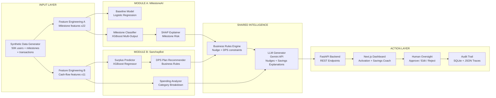
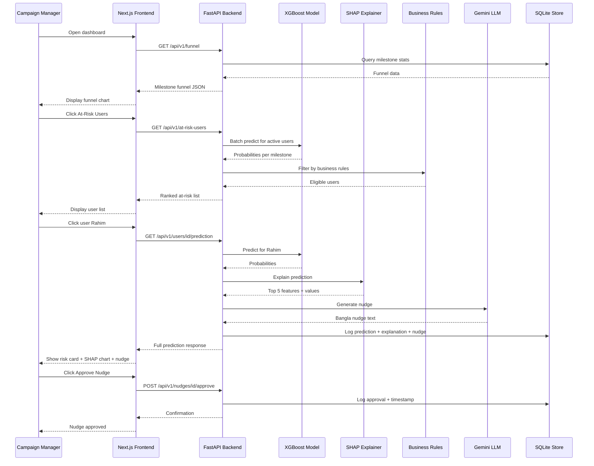

# PRD: MilestoneAI + SanchayBot — Hybrid Activation & Savings Intelligence

**Version:** 2.0 (Hybrid)  
**Date:** 2026-10-01  
**Team Size:** 3 students  
**Build Time:** 50 hours  
**Track:** 04 — Growth & Campaign Intelligence × Track 03 — Customer Innovation & Financial Independence

---

## 1. Overview and Vision

### Vision Statement

MilestoneAI + SanchayBot is a **hybrid activation and financial independence platform** for upay. It combines two synergistic AI modules:

- **Module A — MilestoneAI (Activation Engine):** Predicts which of upay's 6 onboarding milestones each new user will abandon, explains why, and delivers personalized Bangla nudges — turning acquisition spend into retained customers.
- **Module B — SanchayBot (সঞ্চয়বট — DPS Savings Coach):** Analyzes a user's simulated cash-flow patterns, predicts monthly surplus, recommends a personalized DPS savings plan, and explains trade-offs in simple Bangla — helping users become financially independent, not merely active.

The two modules are tightly integrated: **SanchayBot powers the M5 milestone nudge** ("Open a DPS account" — the hardest milestone at 25% base completion) with a concrete, personalized savings plan instead of a generic "open DPS" message. This synergy makes the M5 nudge dramatically more compelling and differentiates the project from both a pure campaign optimizer and a pure savings chatbot.

### Product Overview

#### Module A: MilestoneAI — Milestone Activation Engine

upay runs a 6-step milestone bonus campaign for self-registered users, offering up to ৳200 in staged rewards:

| Milestone | Action | Bonus |
|-----------|--------|-------|
| M1 | App download + PIN set | ৳30 |
| M2 | First recharge (≥৳30) within 30 days | ৳20 |
| M3 | Cash-in or Add Money (≥৳500) within 30 days | ৳30 |
| M4 | Merchant payment (≥৳200) | ৳20 |
| M5 | Open a DPS account | ৳50 |
| M6 | Complete all above → completion bonus | ৳50 |

**The problem:** Many users complete M1–M2 (low-effort) but drop off before M3–M5 (higher-effort, higher-value). upay pays ৳30–50 in early bonuses to users who never become active, wasting acquisition budget.

**MilestoneAI** is a prediction + explanation + nudge-generation system that:
1. **Predicts** which milestone(s) a user will fail to complete (multi-output ML classifier)
2. **Explains** the top risk factors driving the prediction (SHAP feature attribution)
3. **Generates** a personalized Bangla nudge message grounded in the prediction context (LLM)
4. **Recommends** optimal timing and channel for the nudge (business rules + ML)
5. **Tracks** the outcome for feedback and simulated A/B testing

#### Module B: SanchayBot (সঞ্চয়বট) — DPS Savings Coach

upay offers DPS (Deposit Pension Scheme) accounts through banking partners (MTB, NRB Bank, UCB) starting from just ৳200/month. DPS maturity funds can be cashed out free via UCB ATM. Yet only ~25% of new users open a DPS — because they don't understand it, don't know how much they can afford, or don't see the benefit.

**SanchayBot** is a cash-flow intelligence + savings recommendation system that:
1. **Analyzes** a user's simulated transaction history to detect income patterns, recurring expenses, and spending categories
2. **Predicts** monthly surplus available for savings (regression model)
3. **Recommends** a personalized DPS plan: monthly amount (৳200–৳5,000), tenure (6–36 months), and projected maturity value
4. **Explains** the recommendation in simple Bangla: "আপনি প্রতি মাসে গড়ে ৳1,200 খরচের পর ৳2,800 বাঁচাতে পারেন — এর মধ্যে ৳500 ডিপিএসে রাখলে ১ বছরে ৳6,300+ পাবেন"
5. **Shows** spending breakdown and cash-flow visualizations
6. **Feeds** a personalized M5 nudge into the MilestoneAI engine — "open DPS with your recommended ৳500/month plan"

#### How the Two Modules Connect

```
┌─────────────────────────────────────────────────────────────┐
│              MilestoneAI (Module A)                          │
│  Predicts drop-off at M1→M6, generates nudges for M2-M4    │
│                                                             │
│  For M5 (DPS):  ──────────► calls SanchayBot ──────────►   │
│                  "User at risk"    "Here's their savings    │
│                                     plan: ৳500/month for    │
│                                     12 months = ৳6,300+"    │
│                                                             │
│  M5 Nudge = Generic nudge + Personalized savings plan       │
│           = MUCH higher conversion than generic "open DPS"  │
└─────────────────────────────────────────────────────────────┘
│
▼
┌─────────────────────────────────────────────────────────────┐
│              SanchayBot (Module B)                           │
│  Also accessible as standalone Savings Coach page            │
│  - Cash-flow analysis + spending breakdown                  │
│  - DPS recommendation with maturity projection              │
│  - Bangla explanation of spending patterns                   │
│  - Goal-based savings planning (education, emergency, Eid)  │
└─────────────────────────────────────────────────────────────┘
```

---

## 2. Problem Statement and Baseline

### Problem Statement (Official Template)

> **For newly registered upay users**, incomplete milestone activation (completing only 1–2 of 6 bonus milestones) **causes wasted acquisition spend of ৳30–50 per churned user and lost lifetime value of approximately ৳2,400/year**, and **the hardest milestone — M5 (DPS) at 25% completion — fails because users don't understand how much they can save or why DPS matters for them personally**. We will build **MilestoneAI + SanchayBot**, a hybrid AI platform that uses **synthetic behavioral, transaction, and cash-flow data** to **(a) predict each user's drop-off milestone and generate personalized Bangla nudges, and (b) analyze spending patterns to recommend a personalized DPS savings plan**, with success measured by **milestone completion rate improvement from 35% to 50% (+15pp), M5 (DPS) completion rate from 25% to 40% (+15pp), and ৳500 average recommended monthly DPS contribution per eligible user**.

### Baseline Assumptions

| Metric | Assumed Baseline | Source |
|--------|-----------------|--------|
| M1 completion rate | ~95% (PIN set is required for registration) | Assumption: near-universal |
| M2 completion rate | ~70% (first recharge is low-effort) | Industry MFS activation benchmarks |
| M3 completion rate | ~50% (requires ≥৳500 cash-in/add money) | Assumption based on effort barrier |
| M4 completion rate | ~40% (requires merchant payment ≥৳200) | Assumption: merchant payment adoption is lower |
| M5 completion rate | ~25% (opening DPS is unfamiliar for many) | Assumption: DPS is a new/advanced feature |
| Full completion (all 6) | ~35% of registered users | Derived from above funnel |
| Average cost per incomplete user | ৳40 (weighted average of partial bonuses paid) | Calculated from milestone bonus schedule |
| Estimated LTV of fully activated user | ~৳2,400/year | Assumption: ~৳200/month in transaction fees generated |
| DPS adoption among eligible users | ~12% (those who could afford ≥৳200/month but don't open DPS) | Assumption: most users unaware of DPS benefit |
| Average predicted monthly surplus (eligible users) | ~৳2,500 | Synthetic: derived from income minus expenses |
| DPS min monthly contribution | ৳200/month | From upay document: DPS starts at ৳200 |
| DPS maturity free cash-out | Yes, via UCB ATM | From upay document |

**Note:** All baselines are synthetic assumptions. Real baselines would be derived from upay's actual activation data in a post-hackathon validation phase.

---

## 3. Target Users and Personas

### Persona 1: Rahim — The RMG Worker (Primary Target)

| Attribute | Detail |
|-----------|--------|
| **Name** | Rahim Mia |
| **Age** | 28 |
| **Location** | Gazipur (industrial zone) |
| **Occupation** | Garment factory worker |
| **Income** | ৳12,000–15,000/month (salary via upay Secondary Wallet) |
| **Digital literacy** | Low-moderate; uses Facebook, basic smartphone apps |
| **Language** | Bangla only |
| **Pain points** | Doesn't understand DPS; intimidated by merchant payments; only uses cash-out |
| **upay usage** | Receives salary → immediately cash-out at agent (paying ১.৪%/১০০০) |
| **MilestoneAI opportunity** | Predict he'll drop off at M4 (merchant payment) and M5 (DPS). Nudge explaining how merchant payment saves cash-out fees |
| **SanchayBot opportunity** | Salary ৳12,000/month → expenses ~৳9,200 → surplus ~৳2,800 → recommend DPS ৳500/month for 12 months → maturity ৳6,300+. Bangla explanation: "আপনার বেতন থেকে প্রতি মাসে ৫০০ টাকা রাখলে ১ বছরে ৬,৩০০+ টাকা পাবেন — UCB ATM থেকে ফ্রি ক্যাশ আউট!" |

### Persona 2: Fatema — The University Student (Secondary Target)

| Attribute | Detail |
|-----------|--------|
| **Name** | Fatema Akter |
| **Age** | 22 |
| **Location** | Dhaka (Mirpur) |
| **Occupation** | University student, part-time freelancer |
| **Income** | ৳5,000–8,000/month (irregular, via Payoneer + family) |
| **Digital literacy** | High; comfortable with apps and online shopping |
| **Language** | Bangla + English |
| **Pain points** | Forgets to complete activation steps; doesn't see immediate value in all milestones |
| **upay usage** | Add Money from card, mobile recharge, occasional Daraz payment |
| **MilestoneAI opportunity** | Predict she'll skip M3 (cash-in ≥৳500 — she uses Add Money, not Cash-In). Nudge clarifying that Add Money counts toward M3 |
| **SanchayBot opportunity** | Irregular income ৳5,000–8,000 → expenses ~৳4,500 → surplus ~৳2,000 → recommend DPS ৳300/month for 18 months → maturity ৳5,700+ ("নতুন ল্যাপটপের জন্য সঞ্চয়!"). Goal-based: education/device/travel fund |

### Persona 3: Karim — The Rural Agent Customer (Tertiary Target)

| Attribute | Detail |
|-----------|--------|
| **Name** | Karim Uddin |
| **Age** | 45 |
| **Location** | Rangpur (rural, near Village Digital Booth) |
| **Occupation** | Small farmer |
| **Income** | ৳8,000–10,000/month (seasonal) |
| **Digital literacy** | Very low; uses USSD more than app |
| **Language** | Bangla only |
| **Pain points** | Registered by agent at booth; doesn't understand the app; no internet pack (uses zero-data feature on GP) |
| **upay usage** | Receives remittance from son in Dhaka |
| **MilestoneAI opportunity** | Predict drop-off at M2 (recharge — he doesn't recharge via app). Nudge via SMS (USSD context) in simple Bangla explaining recharge benefit |
| **SanchayBot opportunity** | Seasonal income ৳8,000–10,000 → help him save during harvest season for lean months. Simple SMS: "এই মাসে ২০০ টাকা জমা রাখুন, ফসলের সময় কাজে আসবে" |

---

## 4. User Journeys and Stories

### Journey 1: Campaign Manager Views Activation Dashboard

```
Campaign Manager opens MilestoneAI dashboard
→ Sees overall milestone funnel (M1→M6) with completion rates
→ Views "At-Risk Users" list sorted by predicted drop-off probability
→ Clicks on a user to see their predicted drop-off milestone and SHAP explanation
→ Reviews AI-generated nudge suggestion (Bangla)
→ Approves/edits the nudge
→ System logs the approval and marks nudge as "sent" (simulated)
→ Dashboard updates with nudge delivery status
```

**User Stories:**

| ID | Story | Acceptance Criteria |
|----|-------|-------------------|
| US-001 | As a campaign manager, I want to see the milestone completion funnel so I can understand where users drop off | Funnel chart shows M1–M6 rates; data refreshes on page load; percentages are labeled |
| US-002 | As a campaign manager, I want to see a ranked list of at-risk users so I can prioritize interventions | List shows user ID, predicted drop-off milestone, risk probability, top 3 risk factors; sortable by risk score |
| US-003 | As a campaign manager, I want to see an AI explanation of why a user is at risk so I can decide on the right action | SHAP waterfall chart displayed; top 5 features shown with direction and magnitude; plain-English/Bangla summary |
| US-004 | As a campaign manager, I want to see an AI-generated Bangla nudge message so I can send targeted communications | Generated nudge displayed in Bangla; shows which milestone it targets; editable before approval |
| US-005 | As a campaign manager, I want to approve or reject a nudge so that the system doesn't send messages autonomously | Approve/Edit/Reject buttons; audit log of all decisions; no nudge sent without human action |

### Journey 2: User Receives a Nudge (Simulated)

```
System predicts Rahim will drop off at M4 (merchant payment)
→ Generates Bangla nudge: "রহিম, আপনার কাছের দোকানে মাত্র ২০০ টাকা পে করলেই ২০ টাকা বোনাস পাবেন! QR কোড স্ক্যান করুন।"
→ Campaign manager approves
→ Nudge marked as "delivered" (simulated)
→ System tracks if Rahim completes M4 within 48 hours (simulated outcome)
→ Outcome logged for model feedback
```

| ID | Story | Acceptance Criteria |
|----|-------|-------------------|
| US-006 | As the system, I want to generate a nudge grounded in the user's specific context so the message is relevant | Nudge references the specific milestone, the specific bonus amount, and a concrete action |
| US-007 | As the system, I want to track nudge outcomes so we can measure campaign effectiveness | Outcome logged as completed/not-completed within configurable window; outcome linked to nudge ID |

### Journey 3: Analyst Reviews Model Performance

```
Analyst opens Model Performance page
→ Sees AUC-ROC, precision/recall per milestone, calibration plot
→ Checks fairness report (urban vs rural, gender proxy)
→ Views explanation trace for recent predictions
→ Exports metrics for reporting
```

| ID | Story | Acceptance Criteria |
|----|-------|-------------------|
| US-008 | As an analyst, I want to see model performance metrics per milestone so I can identify weak predictions | AUC-ROC, precision, recall, F1 shown per milestone; confusion matrix available |
| US-009 | As an analyst, I want to check fairness across user groups so we can ensure equitable treatment | Metric comparison across urban/rural, gender proxy, registration channel; disparity ratio flagged if >1.2 |
| US-010 | As an analyst, I want to see the explanation trace of any prediction so I can audit the system | Full input features, model output, SHAP values, generated nudge text, and human decision logged and viewable |

### Journey 4: SanchayBot — User Explores Savings Plan (Campaign Manager or User-Facing View)

```
Campaign Manager clicks "Savings Coach" tab for a specific user
→ Sees the user's simulated cash-flow summary (income, expenses, surplus)
→ Views spending breakdown by category (pie/donut chart)
→ Sees AI-recommended DPS plan (monthly amount, tenure, maturity value)
→ Reads LLM-generated Bangla explanation of the recommendation
→ Views projected savings growth chart (line chart over months)
→ Can use the recommendation as an enriched M5 nudge
→ Approves the DPS-enhanced M5 nudge
```

| ID | Story | Acceptance Criteria |
|----|-------|-------------------|
| US-011 | As a campaign manager, I want to see a user's cash-flow analysis so I can understand their savings capacity | Monthly income, expense, surplus displayed; spending categories shown as donut chart; all data labeled as synthetic |
| US-012 | As a campaign manager, I want to see an AI-recommended DPS plan for a user so I can send a targeted M5 nudge | DPS plan shows: recommended monthly amount (৳200–৳5,000), tenure (6–36 months), projected maturity; plan respects ৳200 minimum |
| US-013 | As a campaign manager, I want to see a Bangla explanation of why this DPS plan is suitable for the user | LLM-generated text explains surplus, trade-offs, maturity benefit in simple Bangla; marked as AI-generated |
| US-014 | As a user (user-facing view), I want to ask "আমি কত টাকা সঞ্চয় করতে পারি?" and get a personalized answer | Input: savings goal or open question. Output: personalized plan with monthly contribution, timeline, and maturity value |
| US-015 | As the system, I want to feed the savings plan into the M5 nudge so the nudge is concrete and personalized | M5 nudge includes: recommended DPS amount, projected maturity, how to open DPS from the app |

---

## 5. Functional Requirements

| ID | Requirement | Priority | Notes |
|----|-------------|----------|-------|
| FR-001 | System shall generate synthetic user registration and milestone completion data for 50,000 users | MVP | See Section 8: Synthetic Data Spec |
| FR-002 | System shall compute behavioral features from synthetic transaction/event data | MVP | Features defined in Section 9 |
| FR-003 | System shall train a multi-output XGBoost classifier to predict completion probability for milestones M2–M5 | MVP | M1 excluded (near-universal); M6 is deterministic (all others completed) |
| FR-004 | System shall produce SHAP explanations for each prediction showing top 5 contributing features | MVP | SHAP waterfall per prediction |
| FR-005 | System shall generate personalized Bangla nudge messages using an LLM grounded in prediction context | MVP | Prompt includes milestone, risk factors, user context, bonus amount |
| FR-006 | System shall expose predictions, explanations, and nudges via a RESTful API (FastAPI) | MVP | See Section 12: API Contract |
| FR-007 | System shall display a campaign manager dashboard with milestone funnel, at-risk user list, and user detail view | MVP | Next.js frontend |
| FR-008 | System shall allow campaign manager to approve/edit/reject nudge messages before delivery | MVP | Human-in-the-loop |
| FR-009 | System shall log all predictions, explanations, nudges, and human decisions in an audit trail | MVP | SQLite-backed trace store |
| FR-010 | System shall display model performance metrics (AUC-ROC, precision, recall, calibration) per milestone | MVP | Analyst page |
| FR-011 | System shall display fairness metrics comparing prediction rates across user groups | MVP | Urban/rural, gender proxy |
| FR-012 | System shall support Bangla UI text and Bangla nudge content | MVP | i18n support |
| FR-013 | System shall provide a simulated A/B comparison showing nudged vs. control group outcomes | Stretch | Simulated based on synthetic uplift data |
| FR-014 | System shall support USSD-style SMS nudge rendering for low-data users | Stretch | Text-only format |
| FR-015 | System shall implement prompt injection defenses for the LLM nudge generator | MVP | Input sanitization + output validation |
| **FR-016** | **System shall generate synthetic transaction data (income, expenses, categories) for all 50,000 users** | **MVP** | **See Section 8: Transactions Table** |
| **FR-017** | **System shall compute cash-flow features: monthly income, monthly expense, surplus, spending categories** | **MVP** | **Derived from transactions** |
| **FR-018** | **System shall train a regression model to predict monthly surplus from user profile + transaction patterns** | **MVP** | **XGBoost Regressor or LightGBM** |
| **FR-019** | **System shall recommend a DPS plan (monthly amount, tenure, maturity) based on predicted surplus** | **MVP** | **Business rules: amount = 20-30% of surplus, min ৳200, tenure 6-36 months** |
| **FR-020** | **System shall generate LLM-based Bangla explanation of spending patterns and savings recommendation** | **MVP** | **Grounded in structured cash-flow data** |
| **FR-021** | **System shall display a Savings Coach page with cash-flow summary, spending breakdown, and DPS recommendation** | **MVP** | **Donut chart + line chart + recommendation card** |
| **FR-022** | **System shall integrate the savings recommendation into M5 nudge generation for enriched personalization** | **MVP** | **When primary_drop_off=M5, include DPS plan in nudge context** |
| **FR-023** | **System shall support goal-based savings planning (user inputs a goal amount and timeline)** | **Stretch** | **LLM generates feasibility analysis** |

---

## 6. Non-Functional Requirements

| ID | Category | Requirement | Target |
|----|----------|-------------|--------|
| NFR-001 | Latency | Single prediction + explanation + nudge generation | < 3 seconds end-to-end |
| NFR-002 | Latency | Dashboard page load (with 100 at-risk users) | < 2 seconds |
| NFR-003 | Privacy | No real PII in any data, code, or generated output | Zero PII |
| NFR-004 | Privacy | Synthetic data clearly labeled as synthetic in all outputs | Labels visible in UI and API |
| NFR-005 | Security | LLM prompts validated against injection attempts | Input sanitization regex + output schema validation |
| NFR-006 | Security | API endpoints require basic authentication (API key) | .env-based key |
| NFR-007 | Explainability | Every prediction accompanied by SHAP top-5 feature attribution | Visual (waterfall) + JSON |
| NFR-008 | Explainability | LLM-generated text clearly marked as "AI-generated" | UI label + metadata flag |
| NFR-009 | Accessibility | Bangla text rendering with proper Unicode support | Tested with Bangla fonts |
| NFR-010 | Accessibility | Dashboard usable on mobile viewport (>=375px) | Responsive CSS |
| NFR-011 | Low-data | API responses minimal (< 5KB per prediction response) | Compressed JSON |
| NFR-012 | Fairness | No >20% disparity in prediction rates across defined groups | Measured and displayed |
| NFR-013 | Auditability | All predictions, explanations, nudges, approvals logged with timestamp | SQLite trace table |

---

## 7. AI/ML Requirements

### 7.1 What the Models Predict

| Model | Module | Input | Output | Decision Type |
|-------|--------|-------|--------|------|
| **Milestone Completion Classifier** | A (MilestoneAI) | User registration features + behavioral features (first 48-72h of activity) | Probability of completing each of M2, M3, M4, M5 | Prediction (probability) |
| **Risk Explanation Engine** | A (MilestoneAI) | Same features + model | SHAP values for top 5 features per milestone | Explanation |
| **Monthly Surplus Predictor** | B (SanchayBot) | User profile + aggregated transaction features (income, expenses, categories) | Predicted monthly surplus in BDT | Prediction (regression) |
| **DPS Plan Recommender** | B (SanchayBot) | Predicted surplus + user profile + business rules | Recommended monthly DPS amount, tenure, projected maturity | Recommendation (rule-based on ML output) |
| **Spending Pattern Analyzer** | B (SanchayBot) | Transaction categories + amounts | Spending breakdown by category, anomalies, cash-out ratio | Analysis |
| **Nudge Generator (LLM)** | A+B (Hybrid) | Predicted drop-off milestone + risk factors + user context + bonus amount + (for M5: savings plan + cash-flow summary) | Bangla nudge text (50-150 words) | Generation (advisory, non-autonomous) |
| **Savings Coach Explainer (LLM)** | B (SanchayBot) | Cash-flow data + DPS recommendation + user profile | Bangla explanation of spending patterns and savings advice (100-200 words) | Generation (advisory) |

### 7.2 Why AI Beats Rules

| Approach | Can It Do This? | Explanation |
|----------|----------------|-------------|
| **Rule-based** ("send SMS to everyone at day 7") | Partially | Wastes nudges on users who would complete anyway; misses users who need a nudge at day 2 |
| **Segment-based** ("nudge users in cluster X at day Y") | Better | Captures some group-level patterns but not individual-level interactions |
| **ML-based** (per-user prediction with XGBoost) | Best | Captures non-linear interactions between device type, registration channel, time-of-day patterns, geographic effects, and early behavioral signals to identify individual-level risk at each milestone |

**Concrete example:** A rule "if no recharge within 5 days → send nudge" treats all non-rechargers equally. But ML discovers that a user who registered via agent + uses USSD + is in a rural area has a 82% drop-off risk at M2, while a user who registered via app + uses smartphone + is in Dhaka has only a 15% drop-off risk at M2 despite both not having recharged yet. The former needs an urgent, simple Bangla SMS; the latter will likely complete on their own.

### 7.3 Model vs. Business Rule Separation

| Component | Owned By | Examples |
|-----------|----------|----------|
| **ML Model** | Model layer | "This user has a 78% probability of dropping off at M4" |
| **Business Rules** | Rules engine | "Don't send more than 2 nudges per week"; "Don't nudge users who completed the milestone"; "Minimum gap: 48 hours" |
| **LLM** | GenAI layer | "Generate a Bangla message for milestone M4 targeting a user in Gazipur who works in RMG" |
| **Human Decision** | Campaign manager | "Approve this nudge" / "Edit the message" / "Reject" |

### 7.4 What the LLM May and May Not Decide

| LLM May | LLM May Not |
|---------|-------------|
| Generate a nudge message in Bangla | Approve or send the nudge autonomously |
| Summarize risk factors in plain language | Make guarantees about DPS returns or interest rates |
| Suggest a milestone-specific call to action | Promise bonuses not defined in the campaign |
| Explain the DPS feature in simple terms | Recommend specific loan or credit products |
| Translate the SHAP explanation into Bangla | Access or reference any real user data |
| Explain spending patterns from structured data | Make autonomous financial decisions (approve/deny) |
| Recommend a DPS amount based on predicted surplus | Pressure users to save more than their surplus allows |
| Show projected maturity using standard DPS rates | Guarantee specific returns (say "projected" not "guaranteed") |
| Explain trade-offs ("if you save X, you'll have less for Y") | Hide fees or risks associated with DPS |

---

## 8. Synthetic Data Specification

### 8.1 Entities and Schema

#### Users Table (`users`)

| Column | Type | Description | Distribution |
|--------|------|-------------|--------------|
| user_id | VARCHAR(12) | Unique synthetic ID (e.g., "U000000001") | Sequential |
| registration_date | DATETIME | When the user registered | Uniform over 90-day window |
| registration_channel | ENUM | 'app_self', 'agent_assisted', 'referral' | 50%, 30%, 20% |
| device_type | ENUM | 'smartphone_android', 'smartphone_ios', 'feature_phone' | 70%, 5%, 25% |
| sim_operator | ENUM | 'grameenphone', 'robi', 'banglalink', 'teletalk' | 45%, 25%, 20%, 10% |
| division | ENUM | 8 Bangladesh divisions | Proportional to population |
| area_type | ENUM | 'urban', 'peri_urban', 'rural' | 35%, 30%, 35% |
| age_group | ENUM | '18-25', '26-35', '36-45', '46+' | 25%, 35%, 25%, 15% |
| gender | ENUM | 'male', 'female', 'unknown' | 55%, 35%, 10% |
| has_bank_account | BOOL | Whether user has a linked bank account | 30% True |
| referral_source_id | VARCHAR(12) | Referrer user_id if channel='referral' | Null for non-referral |
| salary_wallet_active | BOOL | Receives salary via Secondary Wallet | 15% True |
| zero_data_eligible | BOOL | GP or Robi user (app without data) | 70% True |

#### Milestone Events Table (`milestone_events`)

| Column | Type | Description |
|--------|------|-------------|
| event_id | VARCHAR(16) | Unique event ID |
| user_id | VARCHAR(12) | FK to users |
| milestone | ENUM | 'M1', 'M2', 'M3', 'M4', 'M5', 'M6' |
| completed | BOOL | Whether the milestone was completed |
| completed_at | DATETIME | Timestamp of completion (null if not completed) |
| days_since_registration | INT | Days between registration and completion |
| bonus_amount_bdt | INT | Bonus earned (30, 20, 30, 20, 50, 50) |

#### Early Activity Table (`early_activity`)

| Column | Type | Description |
|--------|------|-------------|
| user_id | VARCHAR(12) | FK to users |
| first_app_open_hours | FLOAT | Hours between registration and first app open |
| app_opens_day1 | INT | App opens on day 1 |
| app_opens_day2 | INT | App opens on day 2 |
| app_opens_day3 | INT | App opens on day 3 |
| ussd_sessions_day1_3 | INT | USSD sessions in first 3 days |
| balance_check_count_day1_3 | INT | Balance checks in first 3 days |
| screens_visited_day1 | INT | Unique screens visited on day 1 |
| time_in_app_minutes_day1 | FLOAT | Total time in app on day 1 |
| notification_enabled | BOOL | Push notifications enabled |
| language_preference | ENUM | 'bangla', 'english', 'both' |

#### Transactions Table (`transactions`) — NEW for SanchayBot

| Column | Type | Description | Distribution |
|--------|------|-------------|------|
| txn_id | VARCHAR(16) | Unique transaction ID | Sequential |
| user_id | VARCHAR(12) | FK to users | |
| txn_date | DATE | Transaction date | Within 90-day window |
| txn_type | ENUM | 'salary_credit', 'cash_in', 'add_money', 'send_money', 'cash_out', 'merchant_payment', 'bill_pay', 'mobile_recharge', 'remittance_in', 'fund_transfer' | Weighted by persona |
| amount_bdt | INT | Transaction amount | Range: ৳10–৳50,000 |
| category | ENUM | 'income', 'savings', 'food', 'transport', 'utilities', 'shopping', 'recharge', 'transfer', 'cash_withdrawal', 'other' | Derived from txn_type |
| wallet_type | ENUM | 'primary', 'secondary', 'remittance' | primary 60%, secondary 25%, remittance 15% |
| is_inflow | BOOL | True for income/credit, False for expense/debit | Derived from txn_type |

**Generation logic:** Each user gets 15–60 transactions over 30–90 days. Income patterns: salary users get 1 large credit/month; non-salary users get irregular smaller inflows. Expenses: proportional to income with category-weighted distribution.

#### Cash-Flow Summary Table (`cashflow_summary`) — Derived for SanchayBot

| Column | Type | Description |
|--------|------|-------------|
| user_id | VARCHAR(12) | FK to users |
| avg_monthly_income_bdt | INT | Average monthly inflow |
| avg_monthly_expense_bdt | INT | Average monthly outflow |
| avg_monthly_surplus_bdt | INT | Income minus expenses |
| cash_out_ratio | FLOAT | Cash-out amount / total expense (measures cash dependency) |
| top_expense_category | ENUM | Highest expense category |
| income_regularity_score | FLOAT | 0-1, how regular income is (1 = same amount monthly) |
| expense_volatility | FLOAT | Std dev of monthly expenses / mean |
| dps_affordable_amount | INT | Recommended DPS: 20-30% of surplus, min ৳200, max ৳5,000 |
| dps_recommended_tenure | INT | 6, 12, 18, 24, or 36 months based on age/goal |
| dps_projected_maturity | INT | Estimated maturity value (amount × tenure × ~1.05 annual rate) |

### 8.2 Injected Patterns

These are the **known causal patterns** injected into the synthetic data. The ML model should discover these.

**Milestone Patterns (Module A):**

| Pattern ID | Description | Affected Milestones | Mechanism |
|------------|-------------|-------------------|-----------|
| P1 | Agent-assisted registrations have lower M2-M5 completion (user didn't actively choose to register) | M2, M3, M4, M5 | registration_channel='agent_assisted' → -15% completion probability |
| P2 | Feature phone users struggle with M4 (QR payment) and M5 (DPS app navigation) | M4, M5 | device_type='feature_phone' → -25% M4, -35% M5 |
| P3 | Rural users complete M3 (cash-in) at higher rates but struggle with M4 (fewer QR merchants) | M3 up, M4 down | area_type='rural' → +10% M3, -20% M4 |
| P4 | Users who open app >=3 times on day 1 are 2x more likely to complete all milestones | All | app_opens_day1 >= 3 → +25% all |
| P5 | Salary wallet users complete M3 easily (salary = cash-in) but may skip M5 | M3 up, M5 down | salary_wallet_active=True → +30% M3, -10% M5 |
| P6 | Referral-sourced users have higher M2 completion (social pressure) | M2 up | registration_channel='referral' → +15% M2 |
| P7 | Weekend registrations have lower M2 completion | M2 | registration on Sat/Sun → -10% M2 |
| P8 | Users with notifications enabled have +20% completion across all milestones | All | notification_enabled=True → +20% all |

**Cash-Flow / DPS Patterns (Module B — SanchayBot):**

| Pattern ID | Description | Mechanism |
|------------|-------------|-----------|
| P9 | Salary wallet users have higher income regularity (score > 0.8) and larger surplus | salary_wallet_active=True → income_regularity=0.85+, surplus = 25-35% of income |
| P10 | Urban users have higher expenses but also higher income → moderate surplus | area_type='urban' → income ×1.3, expenses ×1.4 |
| P11 | Rural users have lower income but lower expenses → similar surplus ratio | area_type='rural' → income ×0.7, expenses ×0.6 |
| P12 | Young users (18-25) spend more on recharge/shopping, less surplus | age_group='18-25' → recharge/shopping +30%, surplus -15% |
| P13 | Users with high cash-out ratio (>70%) are less likely to open DPS | cash_out_ratio > 0.7 → M5 completion -25% |
| P14 | Users who do more merchant payments have lower cash-out ratio | merchant_payment_count ≥ 3 → cash_out_ratio -20% |

### 8.3 Data Split

| Split | Size | Purpose | Random Seed |
|-------|------|---------|-------------|
| Training | 35,000 users (70%) | Model training (both modules) | seed=42 |
| Validation | 7,500 users (15%) | Hyperparameter tuning, calibration | seed=42 |
| Clean Test | 7,500 users (15%) | Final evaluation only — never used during training | seed=123 (different seed for generation) |

### 8.4 Documented Limitations

1. **No temporal dynamics:** Real user behavior evolves over days/weeks; our synthetic data generates milestone outcomes as a function of registration features + early activity, not a true temporal process.
2. **Independence assumption:** Injected patterns are applied independently; real-world patterns interact in complex ways.
3. **No network effects:** We don't model peer influence (e.g., a user's friends completing milestones).
4. **Simplified geography:** Division-level geographic effects are crude proxies for real geographic variation.
5. **No seasonality:** Real activation rates may vary by festival season, salary cycles, etc.
6. **Simplified DPS interest:** We use a flat ~5% annual return estimate for DPS maturity projections. Real DPS rates vary by bank partner (MTB, NRB, UCB) and tenure.
7. **No real transaction patterns:** Cash-flow data is generated from statistical distributions, not from real MFS transaction logs. Real patterns would show more complex temporal and category correlations.

---

## 9. Feature Engineering

### Features Used for ML Model

| Feature Name | Source | Type | Description |
|-------------|--------|------|-------------|
| registration_channel | users | Categorical | How the user registered |
| device_type | users | Categorical | Phone type |
| sim_operator | users | Categorical | Mobile operator |
| division | users | Categorical | Geographic division |
| area_type | users | Categorical | Urban/peri-urban/rural |
| age_group | users | Categorical | Age bracket |
| gender | users | Categorical | Gender (includes 'unknown') |
| has_bank_account | users | Binary | Bank account linked |
| salary_wallet_active | users | Binary | Receives salary via upay |
| zero_data_eligible | users | Binary | Can use app without data |
| registration_day_of_week | users (derived) | Categorical | Mon-Sun |
| registration_hour | users (derived) | Numerical | Hour of registration (0-23) |
| first_app_open_hours | early_activity | Numerical | Hours to first app open |
| app_opens_day1 | early_activity | Numerical | Day 1 app opens |
| app_opens_day2 | early_activity | Numerical | Day 2 app opens |
| app_opens_day3 | early_activity | Numerical | Day 3 app opens |
| ussd_sessions_day1_3 | early_activity | Numerical | USSD usage in first 3 days |
| balance_check_count_day1_3 | early_activity | Numerical | Balance inquiries |
| screens_visited_day1 | early_activity | Numerical | UI exploration depth |
| time_in_app_minutes_day1 | early_activity | Numerical | Engagement depth |
| notification_enabled | early_activity | Binary | Push notifications on |
| language_preference | early_activity | Categorical | UI language choice |

**Total Milestone features:** 22 (after one-hot encoding: ~45)

### Additional Features for SanchayBot (Module B)

| Feature Name | Source | Type | Description |
|-------------|--------|------|-------------|
| avg_monthly_income_bdt | cashflow_summary | Numerical | Average monthly inflow |
| avg_monthly_expense_bdt | cashflow_summary | Numerical | Average monthly outflow |
| avg_monthly_surplus_bdt | cashflow_summary | Numerical | Income minus expenses |
| cash_out_ratio | cashflow_summary | Numerical | Cash-out / total expense (0-1) |
| income_regularity_score | cashflow_summary | Numerical | How regular income is (0-1) |
| expense_volatility | cashflow_summary | Numerical | Expense std dev / mean |
| top_expense_category | cashflow_summary | Categorical | Dominant expense category |
| txn_count_30d | transactions (agg) | Numerical | Total transactions in 30 days |
| merchant_payment_count | transactions (agg) | Numerical | Merchant payments in 30 days |
| recharge_spend_ratio | transactions (agg) | Numerical | Recharge / total expense |
| bill_pay_count | transactions (agg) | Numerical | Bill payments in 30 days |

**Total SanchayBot features:** 11 additional (combined with shared user profile features: ~33 total for surplus prediction)

---

## 10. Success Metrics

### Business / Customer Metrics

| Metric | Baseline | Target | How Measured |
|--------|----------|--------|-------------|
| Full milestone completion rate (M1-M6) | 35% | 50% (+15pp) | Simulated: completion rate in nudged group vs. control |
| Cost per activated user | ৳114 | ৳80 (-30%) | Total bonuses paid / number of fully activated users |
| Average milestones completed per user | 3.2 | 4.3 | Mean milestones completed across all users |
| M4 (merchant payment) completion rate | 40% | 52% | Nudged M4-at-risk users vs. control |
| **M5 (DPS) completion rate** | **25%** | **40% (+15pp)** | **SanchayBot-enhanced M5 nudge vs. generic nudge vs. control** |
| Nudge acceptance rate (campaign manager) | N/A | >= 80% | Approved nudges / total generated nudges |
| **DPS plans generated** | **0** | **100% of M5-at-risk users** | **Every M5-at-risk user gets a personalized DPS plan** |
| **Average recommended DPS amount** | **N/A** | **৳500/month** | **Mean of recommended amounts across eligible users** |

### Module A: Milestone Model Metrics

| Metric | Target | Per-Milestone Breakdown |
|--------|--------|------------------------|
| AUC-ROC | >= 0.78 overall | M2: >=0.75, M3: >=0.77, M4: >=0.80, M5: >=0.80 |
| Precision (at 50% threshold) | >= 0.70 | Prioritize: don't waste nudges on users who'd complete anyway |
| Recall (at 50% threshold) | >= 0.65 | Don't miss users who will drop off |
| Calibration | Brier score <= 0.20 | Probabilities should be well-calibrated |
| Fairness: Equalized odds ratio | >= 0.80 across groups | Urban vs. rural, male vs. female |

### Module B: Surplus Prediction Model Metrics

| Metric | Target | Notes |
|--------|--------|-------|
| MAE (Mean Absolute Error) of surplus prediction | <= ৳500 | Acceptable error for DPS recommendation |
| R² (coefficient of determination) | >= 0.75 | Surplus prediction explains most variance |
| DPS recommendation accuracy | >= 85% within ±৳200 of "true" affordable amount | Compared against synthetic ground truth |
| Spending category accuracy | >= 90% | Top expense category correctly identified |

---

## 11. System Architecture

### INPUT → INTELLIGENCE → ACTION Diagram (Hybrid)



### Component Interaction Flow



---

## 12. API Contract Draft

### Base URL: `http://localhost:8000/api/v1`

### Endpoints

#### `GET /funnel`
Returns milestone completion funnel statistics.

**Response:**
```json
{
  "total_users": 50000,
  "milestones": [
    {"milestone": "M1", "completed_count": 47500, "rate": 0.95},
    {"milestone": "M2", "completed_count": 35000, "rate": 0.70},
    {"milestone": "M3", "completed_count": 25000, "rate": 0.50},
    {"milestone": "M4", "completed_count": 20000, "rate": 0.40},
    {"milestone": "M5", "completed_count": 12500, "rate": 0.25},
    {"milestone": "M6", "completed_count": 10000, "rate": 0.20}
  ]
}
```

#### `GET /at-risk-users?milestone={M2|M3|M4|M5}&limit={n}&offset={n}`
Returns users predicted to drop off at a specific milestone.

**Response:**
```json
{
  "milestone_filter": "M4",
  "total_at_risk": 8500,
  "users": [
    {
      "user_id": "U000012345",
      "drop_off_milestone": "M4",
      "drop_off_probability": 0.82,
      "top_risk_factors": [
        {"feature": "device_type", "value": "feature_phone", "shap_value": 0.23},
        {"feature": "area_type", "value": "rural", "shap_value": 0.18},
        {"feature": "app_opens_day1", "value": 1, "shap_value": 0.12}
      ],
      "nudge_eligible": true,
      "last_nudge_sent": null
    }
  ]
}
```

#### `GET /users/{user_id}/prediction`
Returns full prediction, explanation, and generated nudge for a specific user.

**Response:**
```json
{
  "user_id": "U000012345",
  "prediction_id": "P_20261001_123456",
  "timestamp": "2026-10-01T15:30:00Z",
  "milestone_probabilities": {
    "M2": {"completion_prob": 0.45, "at_risk": true},
    "M3": {"completion_prob": 0.38, "at_risk": true},
    "M4": {"completion_prob": 0.18, "at_risk": true},
    "M5": {"completion_prob": 0.12, "at_risk": true}
  },
  "primary_drop_off": "M4",
  "explanation": {
    "type": "shap",
    "base_value": 0.40,
    "features": [
      {"name": "device_type_feature_phone", "value": 1, "shap": 0.23, "direction": "increases_risk"},
      {"name": "area_type_rural", "value": 1, "shap": 0.18, "direction": "increases_risk"},
      {"name": "app_opens_day1", "value": 1, "shap": 0.12, "direction": "increases_risk"},
      {"name": "notification_enabled", "value": false, "shap": 0.08, "direction": "increases_risk"},
      {"name": "salary_wallet_active", "value": false, "shap": 0.05, "direction": "increases_risk"}
    ],
    "summary_bn": "ব্যবহারকারী M4 মার্চেন্ট পেমেন্ট পর্যায়ে ঝরে পড়ার উচ্চ ঝুঁকিতে আছেন কারণ তিনি গ্রামীণ এলাকায় ফিচার ফোন ব্যবহার করেন।"
  },
  "nudge": {
    "nudge_id": "N_20261001_123456",
    "target_milestone": "M4",
    "bonus_amount_bdt": 20,
    "text_bn": "আপনার কাছের দোকানে মাত্র ২০০ টাকা QR কোড দিয়ে পে করলেই ২০ টাকা বোনাস পাবেন! ক্যাশ আউট চার্জও বাঁচবে।",
    "text_en": "Pay just 200 taka at your nearest shop using QR code and earn 20 taka bonus! You will also save on cash-out charges.",
    "channel_recommendation": "sms",
    "status": "pending_approval",
    "ai_generated": true,
    "guardrail_passed": true
  },
  "data_is_synthetic": true
}
```

#### `POST /nudges/{nudge_id}/approve`
Campaign manager approves a nudge.

**Request:**
```json
{
  "action": "approve",
  "edited_text_bn": null,
  "approver_id": "CM001"
}
```

#### `GET /model/metrics`
Returns model performance metrics.

#### `GET /model/fairness`
Returns detailed fairness analysis.

#### `GET /traces?limit={n}&user_id={optional}`
Returns explanation traces for audit.

#### `GET /users/{user_id}/savings-plan` — NEW (SanchayBot)
Returns cash-flow analysis and personalized DPS recommendation.

**Response:**
```json
{
  "user_id": "U000012345",
  "cashflow": {
    "avg_monthly_income_bdt": 14000,
    "avg_monthly_expense_bdt": 10200,
    "avg_monthly_surplus_bdt": 3800,
    "cash_out_ratio": 0.62,
    "income_regularity_score": 0.87,
    "top_expense_category": "cash_withdrawal",
    "spending_breakdown": [
      {"category": "cash_withdrawal", "amount_bdt": 4200, "percentage": 41.2},
      {"category": "food", "amount_bdt": 2500, "percentage": 24.5},
      {"category": "recharge", "amount_bdt": 800, "percentage": 7.8},
      {"category": "utilities", "amount_bdt": 1200, "percentage": 11.8},
      {"category": "transport", "amount_bdt": 900, "percentage": 8.8},
      {"category": "other", "amount_bdt": 600, "percentage": 5.9}
    ]
  },
  "dps_recommendation": {
    "recommended_monthly_bdt": 500,
    "tenure_months": 12,
    "projected_maturity_bdt": 6300,
    "percentage_of_surplus": 13.2,
    "dps_minimum_bdt": 200,
    "free_cashout_via": "UCB ATM",
    "rationale": "affordable_surplus"
  },
  "explanation_bn": "আপনার মাসিক আয় প্রায় ১৪,০০০ টাকা এবং খরচ প্রায় ১০,২০০ টাকা। প্রতি মাসে প্রায় ৩,৮০০ টাকা বাঁচে। এর মধ্যে মাত্র ৫০০ টাকা ডিপিএসে রাখলে ১ বছরে ৬,৩০০+ টাকা পাবেন — UCB ATM থেকে সম্পূর্ণ ফ্রি ক্যাশ আউট!",
  "savings_growth_chart": [
    {"month": 1, "total_saved": 500, "projected_value": 502},
    {"month": 6, "total_saved": 3000, "projected_value": 3075},
    {"month": 12, "total_saved": 6000, "projected_value": 6300}
  ],
  "ai_generated": true,
  "data_is_synthetic": true
}
```

#### `POST /savings-plan/goal` — NEW (SanchayBot, Stretch)
User sets a savings goal, gets a feasibility analysis.

**Request:**
```json
{
  "user_id": "U000012345",
  "goal_amount_bdt": 30000,
  "goal_label": "নতুন মোবাইল",
  "target_months": 6
}
```

**Response:**
```json
{
  "feasible": true,
  "required_monthly_bdt": 4850,
  "percentage_of_surplus": 127.6,
  "adjusted_plan": {
    "recommended_monthly_bdt": 2500,
    "adjusted_target_months": 12,
    "projected_total": 31500
  },
  "explanation_bn": "৬ মাসে ৩০,০০০ টাকা জমাতে প্রতি মাসে ৪,৮৫০ টাকা লাগবে — আপনার সারপ্লাসের চেয়ে বেশি। তবে ১২ মাসে ২,৫০০ টাকা করে জমালে ৩১,৫০০+ টাকা পাবেন!",
  "ai_generated": true
}
```

---

## 13. UI Wireframe Descriptions

### Page 1: Dashboard (Campaign Manager Home)

**Layout:** Full-width page with header nav, main content area, and sidebar.

- **Header:** MilestoneAI logo, "Dashboard" / "User Details" / "Model Performance" / "Settings" nav tabs. Language toggle (EN/BN).
- **Top cards row (4 cards):** Total Users (50,000), Active Campaign Users (12,340), Full Completion Rate (35% with trend arrow), At-Risk Users (8,500 with alert badge).
- **Milestone Funnel (left 60%):** Horizontal funnel chart showing M1 to M6 with completion rates, color-coded (green >=60%, yellow 40-60%, red <40%). Clickable milestones filter the at-risk list.
- **At-Risk User List (right 40%):** Scrollable table: User ID, Predicted Drop-Off, Risk Score (color-coded progress bar), Top Factor (chip), Nudge Status (pending/approved/sent). Click to open User Detail page.
- **Bottom section:** "Today's Nudges" — count of pending approvals, approved, rejected. Quick-approve buttons.

### Page 2: User Detail View

**Layout:** Two-column detail page.

- **Left column (40%):**
  - User profile card: User ID, registration date, channel, device, area, division, wallet type. All synthetic-data labeled.
  - Milestone progress tracker: Vertical stepper showing M1-M6, each with check (completed), warning (at-risk), or empty (pending). Completed milestones show date and bonus earned.
- **Right column (60%):**
  - Risk prediction card: Primary drop-off milestone highlighted, probability bar (e.g., "82% likely to miss M4").
  - SHAP waterfall chart: Interactive chart showing top 5 features pushing prediction from base rate.
  - AI explanation (Bangla): Text box with the LLM-generated Bangla summary. Marked with "AI Generated" badge.
  - Nudge preview: Card showing the generated Bangla nudge text, target milestone, bonus amount, recommended channel. **Approve** (green) / **Edit** (yellow) / **Reject** (red) buttons.
  - **SanchayBot panel (shown when M5 is at-risk):** Cash-flow summary card, spending donut chart, DPS recommendation with maturity projection, savings growth line chart. "Use this plan in M5 nudge" button.
  - Audit trail: Collapsible section showing history of predictions and nudges for this user.

### Page 3: Savings Coach (SanchayBot — সঞ্চয়বট) — NEW

**Layout:** User-facing savings intelligence page, accessible from User Detail or as standalone.

- **Top section:** User cash-flow summary card: Monthly Income (৳14,000), Monthly Expenses (৳10,200), Monthly Surplus (৳3,800) with color-coded indicators.
- **Spending Breakdown (left 50%):** Donut/pie chart showing expense categories: cash withdrawal (41%), food (25%), recharge (8%), utilities (12%), transport (9%), other (6%). Hover to see amounts. "ক্যাশ আউট বেশি — ডিজিটাল পেমেন্ট করলে বাঁচবে" insight callout.
- **DPS Recommendation Card (right 50%):**
  - Recommended amount: ৳500/month (highlighted in green)
  - Tenure: 12 months
  - Projected maturity: ৳6,300+ (with growth chart below)
  - "This is 13.2% of your surplus" indicator bar
  - Savings growth line chart: month-by-month projected accumulation
  - "Open DPS" CTA button (simulated)
- **Bangla Explanation Box:** LLM-generated text explaining the recommendation. Marked with 🤖 badge. Example: "আপনার মাসিক আয় থেকে ১০,২০০ টাকা খরচের পর ৩,৮০০ টাকা বাঁচে। মাত্র ৫০০ টাকা ডিপিএসে রাখলে ১ বছরে ৬,৩০০+ টাকা পাবেন!"
- **Goal Planner (Stretch):** Input field: "আমি কত টাকা জমাতে চাই?" with amount and timeline. System returns feasibility analysis.
- **Cash-out Savings Insight:** "আপনি প্রতি মাসে ৫,৮৮০ টাকা ক্যাশ আউট করেন (চার্জ ~৮২ টাকা)। UCB ATM ব্যবহার করলে ৬৩ টাকা বাঁচবে।"

### Page 4: Model Performance (Analyst View)

**Layout:** Metrics dashboard with tabs for Module A and Module B.

- **Tab: Module A (MilestoneAI)**
  - Top row: Overall AUC-ROC gauge, Brier Score gauge, Total Predictions counter.
  - Per-Milestone Metrics: 4-column grid (M2, M3, M4, M5) with AUC-ROC, Precision, Recall, F1.
  - ROC Curves: Multi-line chart for all 4 milestones.
  - Calibration Plot: Predicted probability vs. actual frequency.
  - Fairness Panel: Urban/Rural and Male/Female comparison bars.
  - Feature Importance: Top 15 features by mean absolute SHAP value.
- **Tab: Module B (SanchayBot)**
  - Surplus Prediction: MAE gauge, R² gauge, scatter plot (predicted vs actual surplus).
  - DPS Recommendation Distribution: Histogram of recommended amounts (how many users at ৳200, ৳300, etc.).
  - Category Accuracy: Confusion matrix for top expense category prediction.

---

## 14. Responsible AI Plan

### 14.1 Privacy

- **No real data:** All data is synthetically generated. No PII, no real phone numbers, no real user IDs.
- **Synthetic label:** Every API response includes `"data_is_synthetic": true`. Dashboard shows a persistent "SYNTHETIC DATA" banner.
- **Post-hackathon:** If validated with real data, would require anonymization, aggregation, and governance approval per upay's data policies.

### 14.2 Explainability

- **Per-prediction SHAP:** Every prediction comes with SHAP feature attribution (top 5 features + values + direction).
- **Visual explanation:** SHAP waterfall chart in the UI, accessible to non-technical campaign managers.
- **LLM explanation:** Generated Bangla text summarizing why the user is at risk. Clearly labeled as AI-generated.
- **Separation of concerns:** Predictions (ML model), explanations (SHAP), generated text (LLM), and business decisions (human) are clearly separated in the UI and the audit log.

### 14.3 Fairness

- **Groups checked:** Urban vs. Rural, Male vs. Female (using gender proxy from synthetic data), Registration Channel (self vs. agent-assisted).
- **Metrics:** Equalized odds ratio (TPR and FPR ratios across groups).
- **Threshold:** Disparity ratio must be >= 0.80 (no group's TPR or FPR differs by more than 20%).
- **Display:** Fairness metrics are shown in the analyst dashboard. Warnings flagged if threshold is violated.
- **Mitigation:** If disparity detected, apply calibration adjustment or investigate feature interactions.

### 14.4 Security

- **Prompt injection defense:**
  - Input sanitization: user context fields validated against regex allowlist before being inserted into the LLM prompt.
  - System prompt is non-overridable; user-provided content goes into a delimited `<user_context>` block.
  - Output validation: generated nudge checked for banned patterns (URLs, phone numbers, financial amounts not matching the milestone bonus).
- **Data leakage prevention:** Model features never include raw text or free-form input. LLM receives only structured, pre-validated fields.
- **API security:** API key authentication via `X-API-Key` header. Rate limiting (100 requests/minute).

### 14.5 Human Oversight

- **No autonomous nudge delivery:** Every generated nudge requires campaign manager approval before being marked as "sent."
- **Edit capability:** Campaign manager can modify the nudge text before approval.
- **Audit trail:** Every prediction, explanation, nudge generation, savings plan, and approval/rejection is logged with timestamp, actor, and action.
- **No consequential financial decisions:** The system does not approve, deny, block, or move funds. It only suggests a marketing nudge and a savings recommendation.
- **DPS recommendations are advisory:** SanchayBot recommends a DPS amount but does not auto-open accounts. The user (or campaign manager) must take action.
- **No guaranteed returns:** LLM-generated savings explanations use "projected" not "guaranteed" when discussing maturity values. DPS interest rates are approximate (~5% annual).

### 14.6 Transparency

- **Clear labels:**
  - "ML Prediction" — model-generated probability
  - "AI Explanation" — SHAP-derived feature attribution
  - "AI Generated Nudge" — LLM-produced text
  - "Campaign Manager Decision" — human action
- **Synthetic data disclaimer:** Shown on every page and in API responses.

---

## 15. Scope

### MVP (Must Ship — 50 Hours)

| Component | Deliverable |
|-----------|-------------|
| Synthetic data | 50K users with registration + early activity + milestone outcomes + **transactions + cash-flow summaries** |
| Feature engineering | 22 milestone features + **11 cash-flow features** computed and stored |
| ML model (Module A) | XGBoost multi-output classifier for M2-M5 with SHAP |
| **ML model (Module B)** | **XGBoost regressor for monthly surplus prediction** |
| Baseline | Logistic regression comparison for milestone model |
| **DPS Plan Recommender** | **Business rules engine: surplus → DPS amount/tenure/maturity** |
| LLM generation | Gemini-based Bangla nudge with guardrails + **savings explanation** |
| API | **8 core endpoints** (funnel, at-risk, predict, **savings-plan**, approve, metrics, fairness, traces) |
| Frontend | Dashboard, User Detail (with **SanchayBot panel for M5**), **Savings Coach page**, Model Performance page |
| Responsible AI | SHAP explanations, fairness check, human-in-the-loop, audit log, **advisory-only savings recommendations** |
| Demo | 5-minute scripted demo: **Milestone flow + SanchayBot savings plan** |

### Stretch (If Time Permits)

| Feature | Value |
|---------|-------|
| Simulated A/B test visualization | Show uplift of nudged vs. control groups |
| **Goal-based savings planner** | **User inputs goal amount → system returns feasibility + adjusted plan** |
| USSD/SMS nudge format | Text-only rendering for low-data users |
| Bangla voice preview | Text-to-speech of nudge/savings message |
| Batch nudge approval | Approve multiple nudges at once |
| **Cash-out savings calculator** | **Show how switching from agent cash-out to ATM/merchant saves ৳/month** |

### Out of Scope

| Feature | Reason |
|---------|--------|
| Real upay data integration | No production data access during hackathon |
| Actual nudge delivery (SMS/push) | Would require upay's messaging infrastructure |
| Multi-language support beyond EN/BN | Not needed for Bangladesh market |
| Deep-learning models | Overkill for tabular data; XGBoost is more appropriate |
| User self-service (user-facing app) | Focus is on campaign manager tool |

---

## 16. Risks and Mitigations

| # | Risk | Probability | Impact | Mitigation |
|---|------|-------------|--------|------------|
| R1 | Synthetic data doesn't reflect real activation patterns | High | High | Document all synthetic assumptions; show model discovers injected patterns; explain post-hackathon validation |
| R2 | Model overfits to synthetic data generation logic | Medium | High | Different random seeds for train/test; validate with SHAP; compare with baseline |
| R3 | LLM generates inappropriate or off-brand nudge messages | Medium | Medium | Prompt guardrails + output validation regex + human approval |
| R4 | Gemini API rate limits or downtime during demo | Low | Critical | Cache 10 pre-generated nudges + savings explanations; implement fallback templates |
| R5 | SHAP computation too slow for real-time API | Medium | Medium | Pre-compute SHAP for all users; cache results; use TreeExplainer |
| R6 | Fairness check reveals significant disparity | Medium | Medium | Investigate feature interactions; apply threshold calibration; document |
| R7 | Team runs out of time — hybrid scope is larger | Medium | High | Cut-line: drop goal planner first, then savings chart, then SanchayBot standalone page (keep M5-integrated savings plan) |
| R8 | Surplus prediction model has low R² on synthetic data | Medium | Medium | Simplify to rule-based surplus estimation (income × 0.25) and document; ML adds marginal improvement |
| R9 | DPS recommendation feels too generic | Low | Medium | Personalize with spending insights ("আপনার ক্যাশ আউট খরচ কমালে আরও বাঁচবে") |

---

## 17. Post-Hackathon Path to Controlled Validation

| Phase | Activities | Data Required | Timeline |
|-------|-----------|---------------|----------|
| 1. Technical review | upay engineering reviews architecture, security, code quality | None | Week 1-2 |
| 2. Data feasibility | Identify if real activation event logs exist and in what format | Schema mapping | Week 2-3 |
| 3. Controlled data access | Obtain anonymized, aggregated activation data for 90-day window | Governed data | Week 3-5 |
| 4. Model retraining | Retrain on real data; compare performance vs. synthetic baseline | Training data | Week 5-7 |
| 5. Shadow deployment | Run model in shadow mode alongside existing campaign | Real-time stream | Week 7-10 |
| 6. A/B test design | Design controlled experiment: 5% of new users receive AI nudges | Experiment framework | Week 10-11 |
| 7. Pilot | Run A/B test for 4 weeks; measure completion rate lift | A/B test data | Week 11-15 |
| 8. Decision | Integrate into upay campaign system, iterate, or close | Pilot results | Week 15-16 |

---

## 18. Open Assumptions

| # | Assumption | Impact if Wrong | How to Verify |
|---|-----------|-----------------|---------------|
| A1 | upay's milestone campaign structure (6 milestones, specific bonus amounts) is as described in the upay document | Product design would need adjustment | Confirm with upay product team |
| A2 | Baseline milestone completion rate is ~35% for full completion | Target metrics would shift | Measure against real activation data |
| A3 | Users can be segmented meaningfully by registration channel, device type, and geography | Feature engineering value depends on this | Validate with real data distributions |
| A4 | Campaign managers are the primary users (not automated systems) | UI/UX design would change | Confirm with upay operations |
| A5 | Bangla nudge messages are acceptable communication format for upay | Brand/legal review needed | Review with upay communications team |
| A6 | Gemini API free tier supports adequate Bangla text generation quality | May need to switch providers | Test during development |
| A7 | The estimated LTV of ~2400 taka/year for an activated user is reasonable | Business impact calculation would change | Validate with upay finance team |
| A8 | DPS interest rate of ~5% annual is a reasonable approximation across bank partners (MTB, NRB, UCB) | Maturity projections would change | Verify with upay DPS product team |
| A9 | Users would find a savings recommendation more compelling than a generic "open DPS" nudge for M5 | Hybrid integration value depends on this | Validate with A/B test post-hackathon |
| A10 | Simulated transaction data with 15-60 transactions per user is sufficient to derive meaningful cash-flow patterns | Cash-flow features would be noisy | Real users would have richer transaction histories |
