# upay MilestoneAI + SanchayBot 🚀
### Next-Gen User Lifecycle Acceleration & AI-Powered Savings Engine for MFS

[](https://www.python.org/)
[](https://fastapi.tiangolo.com/)
[](https://xgboost.readthedocs.io/)
[](https://nextjs.org/)
[](https://shap.readthedocs.io/)
[](LICENSE)

---

## 🌟 Executive Summary

**upay MilestoneAI + SanchayBot** is an end-to-end, enterprise-grade AI intelligence platform designed specifically for **upay (UCB Fintech Company Limited)**. It tackles two fundamental challenges in Mobile Financial Services (MFS):

1. **Milestone Drop-offs (MilestoneAI):** Over 68% of newly registered MFS users stall between KYC verification and regular transaction habituation. MilestoneAI uses **Multi-Output XGBoost** and **SHAP TreeExplainer** to predict drop-off risks across 6 critical lifecycle milestones (M1–M6) and dispatches explainable, guardrailed, hyper-personalized Bangla nudges via Google Gemini.
2. **Savings Deficit & Retention (SanchayBot):** Millions of MFS users maintain dormant balances without productive financial growth. SanchayBot computes monthly cash-flow surplus using an **XGBoost Regressor** ($R^2 = 0.9986$), identifies non-essential spending leaks, recommends optimal Deposit Pension Schemes (DPS) with United Commercial Bank (UCB), and leverages upay's unique competitive advantage: **UCB ATM Zero-Charge Cash-Out (0.8% vs competitors' 1.49%-1.85%)**.

---

## 📐 System Architecture

```mermaid
flowchart TB
    subgraph DataEngine["1. Synthetic Data & Feature Store (50,000 Users / 1.25M Txns)"]
        Users["users.csv<br/>Demographics & Channel"]
        Txns["transactions.csv<br/>1.25M Temporal Txns"]
        Early["early_activity.csv<br/>First 7 Days Actions"]
        Features["Feature Store<br/>48 Milestone + 30 Cashflow Features"]
    end

    subgraph MLEngine["2. Machine Learning & Explainable AI"]
        XGB_Drop["Multi-Output XGBoost Classifiers<br/>M2-M5 AUC: 0.742 - 0.787"]
        XGB_Surp["XGBoost Surplus Regressor<br/>MAE: ৳279 BDT | R²: 0.9986"]
        SHAP["SHAP TreeExplainer<br/>Top-3 Micro-Drivers per User"]
        Fairness["Fairness Auditor<br/>Equalized Odds (Urban/Rural, Gender)"]
    end

    subgraph BackendAPI["3. FastAPI Backend & Microservices"]
        PredictSvc["Prediction Service<br/>Vectorized Inference + Cached Models"]
        RulesEng["Smart Rules Engine<br/>Cooldowns, Frequency Caps, Suppression"]
        NudgeSvc["Nudge Service<br/>Gemini 1.5 + Zero-Shot Fallback Engine"]
        SavingsSvc["SanchayBot Planner<br/>Surplus Tiering + UCB ATM Calculator"]
        TraceSvc["Audit & Tracing DB<br/>SQLite Execution Logs & Prompt Hashes"]
    end

    subgraph FrontendApp["4. Next.js 14 Glassmorphic Dashboard"]
        Funnel["M1-M6 Funnel Drop-off Visualizer"]
        AtRisk["At-Risk Prioritization Queue"]
        Waterfall["SHAP Waterfall Explainer"]
        NudgeCard["Bilingual (EN/BN) Nudge Preview"]
        Sanchay["SanchayBot DPS Coach & Simulator"]
        ModelPerf["Model Performance & Fairness Monitor"]
    end

    DataEngine --> MLEngine
    MLEngine --> BackendAPI
    BackendAPI --> FrontendApp
```



---

## 🔬 Core Highlights & Innovations

### 1. Synthetic Behavioral Injection Patterns
To simulate real-world Bangladesh MFS behavioral dynamics, our data engine injects three empirical patterns:
- **Pattern P1 (Rural Agent Inactivity):** Rural users with agent onboarding and no agent interaction within 48h exhibit a **+42% drop-off rate at M3 (First P2P/Payment)**.
- **Pattern P2 (Airtime Addicts):** Users with $\ge 3$ airtime top-ups in their first 3 days show an **82% habituation rate at M5 (3+ Distinct Services)**.
- **Pattern P3 (Female Rural Cash-In Drop-off):** Female rural users experience a **38% higher M4 (First Cash-In/Add Money) drop-off**, audited via our automated Fairness Suite.

### 2. Multi-Milestone Dropout Prediction (Module A)
- **M1 (Registration & KYC):** Completed at onboarding.
- **M2 (First App Login & PIN Setup):** Test AUC **0.7423**.
- **M3 (First Transaction / P2P):** Test AUC **0.7505**.
- **M4 (First Cash-In / Add Money):** Test AUC **0.7840**.
- **M5 (Multi-Service Adoption):** Test AUC **0.7869**.
- **M6 (Habituation - 30-Day Retention):** Derived habituation status.

### 3. SHAP TreeExplainer Micro-Driver Isolation
Every at-risk prediction produces localized SHAP values that isolate the exact behavioral friction point (e.g., `days_since_reg`, `agent_assisted`, `p2p_out_count`, `cash_in_volume`). These top drivers directly feed the LLM prompt.

### 4. Zero-Shot Fallback & Guardrailed LLM Nudges
- **Bangla Linguistic Integrity:** Native Bangladeshi financial terminology (`ক্যাশ-ইন`, `সেন্ড মানি`, `ডিপিএস`, `সঞ্চয়`, `ইউসিবি এটিএম`).
- **Prompt Injection Defense:** Strict regex sanitization filters harmful characters, code tags, and command keywords.
- **Resilience:** If the Google Gemini API is throttled or offline, the system instantly engages zero-shot templated fallbacks with identical feature-driven variables.
- **Anti-Spam Frequency Capping:** Max 2 nudges per user per 7 days; mandatory 48-hour cooldown between interventions.

### 5. SanchayBot Cashflow Engine & UCB Zero-Charge Advantage (Module B)
- Estimates real monthly disposable surplus:
  $$\text{Surplus} = \text{Monthly Inflow} - (\text{Utility} + \text{Merchant} + \text{P2P Out} + \text{Cash Out})$$
- Generates 3 tiered DPS plans (Conservative 30%, Balanced 50%, Growth 70% of surplus).
- Highlights **UCB ATM Zero-Charge Cash-Out**:
  - Competitor cash-out (1.49% - 1.85%): User loses ৳149–৳185 per ৳10,000 cash-out.
  - **upay at UCB ATM: ৳8 per ৳1,000 (0.8%) or FREE for select DPS maturity redemptions.**
  - Quantifies annual fee savings directly to the user (e.g., *"Save ৳1,260/year on cash-out fees alone!"*).

---

## 📊 Model Evaluation & Fairness Audit

| Milestone / Metric | Baseline (Logistic Reg) | MilestoneAI (XGBoost) | Lift (Δ AUC) |
| :--- | :---: | :---: | :---: |
| **M2 (First Login / PIN)** | 0.7012 | **0.7423** | +0.0411 |
| **M3 (First P2P / Txn)** | 0.7188 | **0.7505** | +0.0317 |
| **M4 (First Cash-In)** | 0.7340 | **0.7840** | +0.0500 |
| **M5 (Habituation)** | 0.7410 | **0.7869** | +0.0459 |
| **Overall Macro AUC** | 0.7238 | **0.7659** | **+0.0421** |
| **Brier Score (Calibrated)** | 0.2014 | **0.1677** | -0.0337 (Better) |
| **Surplus Regressor $R^2$** | — | **0.9986** | MAE: ৳279 BDT |

### Fairness Audit (Equalized Odds Ratio)
- **Urban vs. Rural:** M2: 0.95 | M3: 0.89 | M4: 0.43 (P3 detected) | M5: 0.92
- **Male vs. Female:** M2: 0.98 | M3: 0.94 | M4: 0.88 | M5: 0.96

---

## 📁 Repository Structure

```
milestone-ai/
├── backend/
│   ├── app/
│   │   ├── config.py             # App configuration & absolute path resolution
│   │   ├── database.py           # SQLite async database with schema migration
│   │   ├── main.py               # FastAPI entrypoint, middleware, CORS
│   │   ├── models/schemas.py     # Pydantic v2 schemas
│   │   ├── routers/              # API endpoints
│   │   │   ├── funnel.py         # Lifecycle funnel metrics & at-risk queue
│   │   │   ├── users.py          # User prediction & SHAP explanation
│   │   │   ├── nudges.py         # LLM nudge generation & feedback
│   │   │   ├── savings.py        # SanchayBot DPS recommendations
│   │   │   ├── metrics.py        # Model accuracy, ROC & fairness reports
│   │   │   └── traces.py         # Audit logs & execution traces
│   │   ├── services/             # Core business logic
│   │   │   ├── prediction_service.py # Vectorized XGBoost + SHAP lookup
│   │   │   ├── nudge_service.py      # Gemini LLM + fallback templates
│   │   │   ├── rules_engine.py       # Cooldowns, frequency caps
│   │   │   ├── savings_service.py    # Cashflow calculation & DPS planner
│   │   │   └── trace_service.py      # Observability & audit trail
│   │   └── utils/
│   │       ├── bangla_utils.py       # Bangla numeral and currency formatting
│   │       └── sanitizer.py          # Anti-prompt injection defense
│   ├── Dockerfile
│   └── requirements.txt
├── frontend/
│   ├── src/
│   │   ├── app/
│   │   │   ├── layout.tsx            # Root layout with LanguageProvider
│   │   │   ├── page.tsx              # Executive Funnel & At-Risk Dashboard
│   │   │   ├── users/[id]/page.tsx   # User Detail, SHAP & Nudge View
│   │   │   ├── savings/page.tsx      # SanchayBot DPS Coach & Simulator
│   │   │   └── performance/page.tsx  # ML Performance & Fairness Auditing
│   │   ├── components/           # 12+ Glassmorphic React Components
│   │   └── lib/                  # API client, i18n dictionary, context
│   ├── Dockerfile
│   └── package.json
├── ml/                           # ML Training & Pipeline Scripts
│   ├── data_generator.py         # 50,000 synthetic users & milestones
│   ├── transaction_generator.py  # 1.25M synthetic transactions
│   ├── feature_engineering.py    # 48 lifecycle features
│   ├── cashflow_features.py      # 30 cashflow features
│   ├── train_baseline.py         # Logistic Regression baseline
│   ├── train_xgboost.py          # Multi-output XGBoost training
│   ├── train_surplus.py          # Surplus regressor training
│   ├── shap_explainer.py         # SHAP TreeExplainer extraction
│   ├── fairness_check.py         # Equalized odds fairness auditor
│   └── evaluate_model.py         # Calibration curves & ROC evaluation
├── models/                       # Serialized Joblib Models & Reports
├── data/                         # Generated CSV Data Stores
├── tests/                        # Comprehensive Pytest Suite
│   ├── test_api.py
│   └── test_data_generator.py
├── docker-compose.yml
└── README.md
```

---

## 🚀 Quickstart Guide

### Prerequisites
- Python 3.10 or higher
- Node.js 18 or higher & npm
- (Optional) Docker & Docker Compose

### 1. Backend Setup & Run

```bash
# Navigate to backend directory
cd milestone-ai

# Install Python dependencies
pip install -r backend/requirements.txt
pip install pytest httpx

# Start the FastAPI backend server
python -m uvicorn app.main:app --app-dir backend --host 127.0.0.1 --port 8000 --reload
```

The API interactive Swagger documentation will be available at:
`http://127.0.0.1:8000/docs`

### 2. Frontend Setup & Run

```bash
# In a new terminal, navigate to frontend directory
cd milestone-ai/frontend

# Install dependencies
npm install

# Start the Next.js development server
npm run dev
```

Open your browser and navigate to:
`http://localhost:3000`

### 3. Run Automated Tests

```bash
# In the milestone-ai directory
python -m pytest tests/ -v
```

### 4. Running with Docker Compose

To launch the complete unified stack with a single command:

```bash
docker-compose up --build
```

- Dashboard: `http://localhost:3000`
- API Backend: `http://localhost:8000`
- API Documentation: `http://localhost:8000/docs`

---

## 🔌 API Endpoint Reference

| Method | Endpoint | Description |
| :--- | :--- | :--- |
| `GET` | `/health` | Service health & model registry status |
| `GET` | `/api/v1/funnel` | Aggregated M1–M6 funnel counts and conversion rates |
| `GET` | `/api/v1/at-risk-users` | Paginated queue of users flagged for drop-off |
| `GET` | `/api/v1/users/{id}/prediction` | User risk probabilities & top-3 SHAP micro-drivers |
| `POST` | `/api/v1/users/{id}/nudge` | Generate guardrailed Bangla/English intervention nudge |
| `POST` | `/api/v1/nudges/{id}/feedback` | Log delivery status and user engagement (clicked/dismissed) |
| `GET` | `/api/v1/users/{id}/savings-plan` | SanchayBot cash-flow surplus & UCB DPS recommendations |
| `GET` | `/api/v1/model/metrics` | Model ROC-AUC, Brier score, and accuracy metrics |
| `GET` | `/api/v1/model/fairness` | Equalized odds ratios across gender and district segments |
| `GET` | `/api/v1/traces` | Audit log of API calls, model executions, and prompt hashes |

---

## 🛡️ Security, Privacy & Ethics

1. **Synthetic Data Guarantee:** All 50,000 user profiles and 1.25M transactions are procedurally generated with mathematical privacy guarantees. No real customer PII is utilized or exposed.
2. **Deterministic Fallbacks:** The platform maintains 100% operational uptime by falling back to verified, linguistically vetted templates if third-party LLMs encounter downtime or rate limits.
3. **Prompt Injection Sanitizer:** Inbound strings are filtered against adversarial tokens, control sequences, and malicious payload injections.
4. **Fairness-First Governance:** Continuous monitoring of disparate impact ensures rural and underrepresented demographics receive equitable intervention support.

---

## 👥 Hackathon Team & Acknowledgments
Built with ❤️ for the **upay AI Hackathon** to accelerate financial inclusion and empower millions of Bangladeshi citizens with smart, accessible digital banking.
